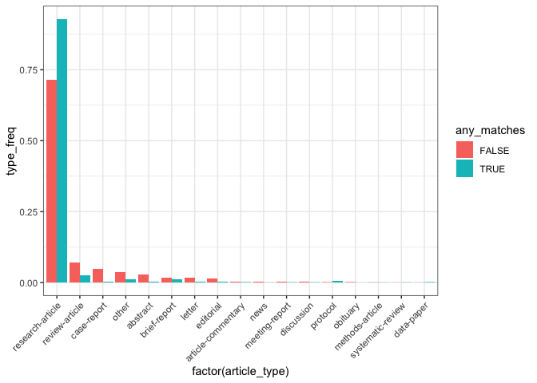
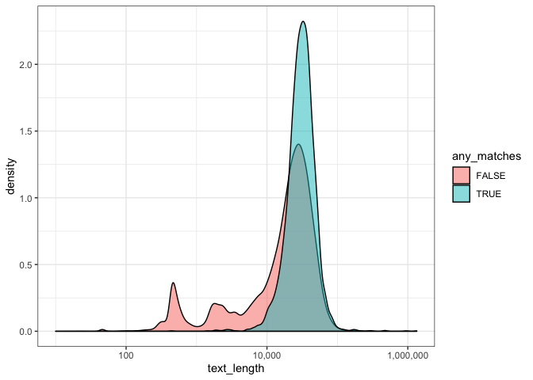

Article Metadata Summaries
================
Toph Allen
4/9/2019

``` r
articles <- read_csv(here("data", "articles.csv")) %>%
  select(-X1, -id_types, -keywords)
id_types <- read_csv(here("data", "id_types.csv")) %>%
  select(-X1)
keywords <- read_csv(here("data", "keywords.csv")) %>%
  select(-X1)
text_matches <- read_csv(here("data", "text_matches.csv")) %>%
  select(-X1)
geonames <- read_csv(here("data", "geonames.csv")) %>%
  select(-X1)
```

## Prevalence of Text Matches

We searched for four terms in the extracted text of articles, using
MongoDB’s text search capabilities. We think these terms will select
articles which have a fieldwork component over those that don’t. The
terms used are: `["field work", "fieldwork", "field study", "study
site"]`.

Matching articles are a smallish subset of the total, 2.346%.

``` r
ktable(articles$any_matches)
```

<table class="table table-hover table-condensed table-responsive" style="width: auto !important; ">

<thead>

<tr>

<th style="text-align:left;">

Var1

</th>

<th style="text-align:right;">

Freq

</th>

</tr>

</thead>

<tbody>

<tr>

<td style="text-align:left;">

FALSE

</td>

<td style="text-align:right;">

48827

</td>

</tr>

<tr>

<td style="text-align:left;">

TRUE

</td>

<td style="text-align:right;">

1173

</td>

</tr>

</tbody>

</table>

``` r
ktable(articles$text_matches)
```

<table class="table table-hover table-condensed table-responsive" style="width: auto !important; ">

<thead>

<tr>

<th style="text-align:left;">

Var1

</th>

<th style="text-align:right;">

Freq

</th>

</tr>

</thead>

<tbody>

<tr>

<td style="text-align:left;">

\[‘field study’, ‘study site’\]

</td>

<td style="text-align:right;">

20

</td>

</tr>

<tr>

<td style="text-align:left;">

\[‘field study’\]

</td>

<td style="text-align:right;">

85

</td>

</tr>

<tr>

<td style="text-align:left;">

\[‘field work’, ‘field study’, ‘study site’\]

</td>

<td style="text-align:right;">

1

</td>

</tr>

<tr>

<td style="text-align:left;">

\[‘field work’, ‘field study’\]

</td>

<td style="text-align:right;">

3

</td>

</tr>

<tr>

<td style="text-align:left;">

\[‘field work’, ‘fieldwork’, ‘study site’\]

</td>

<td style="text-align:right;">

8

</td>

</tr>

<tr>

<td style="text-align:left;">

\[‘field work’, ‘fieldwork’\]

</td>

<td style="text-align:right;">

16

</td>

</tr>

<tr>

<td style="text-align:left;">

\[‘field work’, ‘study site’\]

</td>

<td style="text-align:right;">

32

</td>

</tr>

<tr>

<td style="text-align:left;">

\[‘field work’\]

</td>

<td style="text-align:right;">

101

</td>

</tr>

<tr>

<td style="text-align:left;">

\[‘fieldwork’, ‘field study’, ‘study site’\]

</td>

<td style="text-align:right;">

2

</td>

</tr>

<tr>

<td style="text-align:left;">

\[‘fieldwork’, ‘field study’\]

</td>

<td style="text-align:right;">

2

</td>

</tr>

<tr>

<td style="text-align:left;">

\[‘fieldwork’, ‘study site’\]

</td>

<td style="text-align:right;">

37

</td>

</tr>

<tr>

<td style="text-align:left;">

\[‘fieldwork’\]

</td>

<td style="text-align:right;">

166

</td>

</tr>

<tr>

<td style="text-align:left;">

\[‘study site’\]

</td>

<td style="text-align:right;">

700

</td>

</tr>

</tbody>

</table>

``` r
text_matches %>%
  filter(!is.na(text_matches)) %>%
  ggplot(aes(x = factor(text_matches))) +
  geom_bar(stat = "count") +
  theme_bw()
```

<!-- -->

## Examining characteristics of the subset

I pulled a few pieces of metadata for our subset of articles. These
include:

  - What type of article is it?
  - Does it have a `<body>` tag?
  - How long is it?
  - Associated keywords
  - What types of document identifiers does it have?

### Article types

There are many article types, but only a few which are widely used.

``` r
articles %<>%
  mutate(article_type = fct_infreq(article_type))
ktable(articles$article_type)
```

<table class="table table-hover table-condensed table-responsive" style="width: auto !important; ">

<thead>

<tr>

<th style="text-align:left;">

Var1

</th>

<th style="text-align:right;">

Freq

</th>

</tr>

</thead>

<tbody>

<tr>

<td style="text-align:left;">

research-article

</td>

<td style="text-align:right;">

36358

</td>

</tr>

<tr>

<td style="text-align:left;">

review-article

</td>

<td style="text-align:right;">

3313

</td>

</tr>

<tr>

<td style="text-align:left;">

case-report

</td>

<td style="text-align:right;">

2274

</td>

</tr>

<tr>

<td style="text-align:left;">

other

</td>

<td style="text-align:right;">

1800

</td>

</tr>

<tr>

<td style="text-align:left;">

abstract

</td>

<td style="text-align:right;">

1322

</td>

</tr>

<tr>

<td style="text-align:left;">

brief-report

</td>

<td style="text-align:right;">

801

</td>

</tr>

<tr>

<td style="text-align:left;">

editorial

</td>

<td style="text-align:right;">

785

</td>

</tr>

<tr>

<td style="text-align:left;">

book-review

</td>

<td style="text-align:right;">

772

</td>

</tr>

<tr>

<td style="text-align:left;">

letter

</td>

<td style="text-align:right;">

759

</td>

</tr>

<tr>

<td style="text-align:left;">

correction

</td>

<td style="text-align:right;">

626

</td>

</tr>

<tr>

<td style="text-align:left;">

news

</td>

<td style="text-align:right;">

224

</td>

</tr>

<tr>

<td style="text-align:left;">

article-commentary

</td>

<td style="text-align:right;">

201

</td>

</tr>

<tr>

<td style="text-align:left;">

meeting-report

</td>

<td style="text-align:right;">

163

</td>

</tr>

<tr>

<td style="text-align:left;">

discussion

</td>

<td style="text-align:right;">

95

</td>

</tr>

<tr>

<td style="text-align:left;">

protocol

</td>

<td style="text-align:right;">

85

</td>

</tr>

<tr>

<td style="text-align:left;">

obituary

</td>

<td style="text-align:right;">

83

</td>

</tr>

<tr>

<td style="text-align:left;">

product-review

</td>

<td style="text-align:right;">

56

</td>

</tr>

<tr>

<td style="text-align:left;">

rapid-communication

</td>

<td style="text-align:right;">

45

</td>

</tr>

<tr>

<td style="text-align:left;">

in-brief

</td>

<td style="text-align:right;">

39

</td>

</tr>

<tr>

<td style="text-align:left;">

methods-article

</td>

<td style="text-align:right;">

33

</td>

</tr>

<tr>

<td style="text-align:left;">

reply

</td>

<td style="text-align:right;">

33

</td>

</tr>

<tr>

<td style="text-align:left;">

retraction

</td>

<td style="text-align:right;">

28

</td>

</tr>

<tr>

<td style="text-align:left;">

systematic-review

</td>

<td style="text-align:right;">

25

</td>

</tr>

<tr>

<td style="text-align:left;">

data-paper

</td>

<td style="text-align:right;">

22

</td>

</tr>

<tr>

<td style="text-align:left;">

introduction

</td>

<td style="text-align:right;">

21

</td>

</tr>

<tr>

<td style="text-align:left;">

report

</td>

<td style="text-align:right;">

10

</td>

</tr>

<tr>

<td style="text-align:left;">

announcement

</td>

<td style="text-align:right;">

7

</td>

</tr>

<tr>

<td style="text-align:left;">

addendum

</td>

<td style="text-align:right;">

4

</td>

</tr>

<tr>

<td style="text-align:left;">

books-received

</td>

<td style="text-align:right;">

4

</td>

</tr>

<tr>

<td style="text-align:left;">

calendar

</td>

<td style="text-align:right;">

4

</td>

</tr>

<tr>

<td style="text-align:left;">

oration

</td>

<td style="text-align:right;">

4

</td>

</tr>

<tr>

<td style="text-align:left;">

expression-of-concern

</td>

<td style="text-align:right;">

2

</td>

</tr>

<tr>

<td style="text-align:left;">

index

</td>

<td style="text-align:right;">

2

</td>

</tr>

</tbody>

</table>

``` r
articles %>% 
  group_by(article_type) %>%
  mutate(n = n()) %>%
  filter(n > 50) %>%
  ungroup() %>%
  ggplot(aes(x = factor(article_type))) +
  geom_bar() +
  theme_bw() + theme(axis.text.x = element_text(angle = 45, hjust = 1))
```

<!-- -->

Does the usage of these differ between the fieldwork subset?

``` r
articles %>% 
  group_by(any_matches) %>%
  mutate(n_matches = n()) %>%
  group_by(any_matches, article_type) %>%
  summarize(type_freq = (n() / n_matches)[1]) %>%
  ungroup() %>%
  group_by(article_type) %>%
  filter(n() > 1) %>%
  ungroup() %>%
  ggplot(aes(x = factor(article_type), y = type_freq, fill = any_matches)) +
  geom_col(position = "dodge") +
  theme_bw() + theme(axis.text.x = element_text(angle = 45, hjust = 1))
```

<!-- -->

There are more research articles, and fewer of everything else.

### Presence of `<body>` tag

``` r
ktable(articles$has_body)
```

<table class="table table-hover table-condensed table-responsive" style="width: auto !important; ">

<thead>

<tr>

<th style="text-align:left;">

Var1

</th>

<th style="text-align:right;">

Freq

</th>

</tr>

</thead>

<tbody>

<tr>

<td style="text-align:left;">

FALSE

</td>

<td style="text-align:right;">

4519

</td>

</tr>

<tr>

<td style="text-align:left;">

TRUE

</td>

<td style="text-align:right;">

45481

</td>

</tr>

</tbody>

</table>

``` r
ktable(articles$article_type, articles$has_body)
```

<table class="table table-hover table-condensed table-responsive" style="width: auto !important; ">

<thead>

<tr>

<th style="text-align:left;">

</th>

<th style="text-align:right;">

FALSE

</th>

<th style="text-align:right;">

TRUE

</th>

</tr>

</thead>

<tbody>

<tr>

<td style="text-align:left;">

research-article

</td>

<td style="text-align:right;">

2056

</td>

<td style="text-align:right;">

34302

</td>

</tr>

<tr>

<td style="text-align:left;">

review-article

</td>

<td style="text-align:right;">

115

</td>

<td style="text-align:right;">

3198

</td>

</tr>

<tr>

<td style="text-align:left;">

case-report

</td>

<td style="text-align:right;">

13

</td>

<td style="text-align:right;">

2261

</td>

</tr>

<tr>

<td style="text-align:left;">

other

</td>

<td style="text-align:right;">

1021

</td>

<td style="text-align:right;">

779

</td>

</tr>

<tr>

<td style="text-align:left;">

abstract

</td>

<td style="text-align:right;">

270

</td>

<td style="text-align:right;">

1052

</td>

</tr>

<tr>

<td style="text-align:left;">

brief-report

</td>

<td style="text-align:right;">

17

</td>

<td style="text-align:right;">

784

</td>

</tr>

<tr>

<td style="text-align:left;">

editorial

</td>

<td style="text-align:right;">

79

</td>

<td style="text-align:right;">

706

</td>

</tr>

<tr>

<td style="text-align:left;">

book-review

</td>

<td style="text-align:right;">

500

</td>

<td style="text-align:right;">

272

</td>

</tr>

<tr>

<td style="text-align:left;">

letter

</td>

<td style="text-align:right;">

137

</td>

<td style="text-align:right;">

622

</td>

</tr>

<tr>

<td style="text-align:left;">

correction

</td>

<td style="text-align:right;">

25

</td>

<td style="text-align:right;">

601

</td>

</tr>

<tr>

<td style="text-align:left;">

news

</td>

<td style="text-align:right;">

93

</td>

<td style="text-align:right;">

131

</td>

</tr>

<tr>

<td style="text-align:left;">

article-commentary

</td>

<td style="text-align:right;">

3

</td>

<td style="text-align:right;">

198

</td>

</tr>

<tr>

<td style="text-align:left;">

meeting-report

</td>

<td style="text-align:right;">

98

</td>

<td style="text-align:right;">

65

</td>

</tr>

<tr>

<td style="text-align:left;">

discussion

</td>

<td style="text-align:right;">

2

</td>

<td style="text-align:right;">

93

</td>

</tr>

<tr>

<td style="text-align:left;">

protocol

</td>

<td style="text-align:right;">

0

</td>

<td style="text-align:right;">

85

</td>

</tr>

<tr>

<td style="text-align:left;">

obituary

</td>

<td style="text-align:right;">

72

</td>

<td style="text-align:right;">

11

</td>

</tr>

<tr>

<td style="text-align:left;">

product-review

</td>

<td style="text-align:right;">

0

</td>

<td style="text-align:right;">

56

</td>

</tr>

<tr>

<td style="text-align:left;">

rapid-communication

</td>

<td style="text-align:right;">

0

</td>

<td style="text-align:right;">

45

</td>

</tr>

<tr>

<td style="text-align:left;">

in-brief

</td>

<td style="text-align:right;">

1

</td>

<td style="text-align:right;">

38

</td>

</tr>

<tr>

<td style="text-align:left;">

methods-article

</td>

<td style="text-align:right;">

0

</td>

<td style="text-align:right;">

33

</td>

</tr>

<tr>

<td style="text-align:left;">

reply

</td>

<td style="text-align:right;">

7

</td>

<td style="text-align:right;">

26

</td>

</tr>

<tr>

<td style="text-align:left;">

retraction

</td>

<td style="text-align:right;">

0

</td>

<td style="text-align:right;">

28

</td>

</tr>

<tr>

<td style="text-align:left;">

systematic-review

</td>

<td style="text-align:right;">

0

</td>

<td style="text-align:right;">

25

</td>

</tr>

<tr>

<td style="text-align:left;">

data-paper

</td>

<td style="text-align:right;">

0

</td>

<td style="text-align:right;">

22

</td>

</tr>

<tr>

<td style="text-align:left;">

introduction

</td>

<td style="text-align:right;">

2

</td>

<td style="text-align:right;">

19

</td>

</tr>

<tr>

<td style="text-align:left;">

report

</td>

<td style="text-align:right;">

0

</td>

<td style="text-align:right;">

10

</td>

</tr>

<tr>

<td style="text-align:left;">

announcement

</td>

<td style="text-align:right;">

0

</td>

<td style="text-align:right;">

7

</td>

</tr>

<tr>

<td style="text-align:left;">

addendum

</td>

<td style="text-align:right;">

0

</td>

<td style="text-align:right;">

4

</td>

</tr>

<tr>

<td style="text-align:left;">

books-received

</td>

<td style="text-align:right;">

0

</td>

<td style="text-align:right;">

4

</td>

</tr>

<tr>

<td style="text-align:left;">

calendar

</td>

<td style="text-align:right;">

3

</td>

<td style="text-align:right;">

1

</td>

</tr>

<tr>

<td style="text-align:left;">

oration

</td>

<td style="text-align:right;">

3

</td>

<td style="text-align:right;">

1

</td>

</tr>

<tr>

<td style="text-align:left;">

expression-of-concern

</td>

<td style="text-align:right;">

0

</td>

<td style="text-align:right;">

2

</td>

</tr>

<tr>

<td style="text-align:left;">

index

</td>

<td style="text-align:right;">

2

</td>

<td style="text-align:right;">

0

</td>

</tr>

</tbody>

</table>

### Length

``` r
types <- articles %>%
  group_by(any_matches) %>%
  mutate(match_n = n()) %>%
  group_by(article_type) %>%
  mutate(type_n = n()) %>%
  group_by(any_matches, article_type) %>%
  summarize(match_x_type = n(),
            match_n = match_n[1],
            type_n = type_n[1]) %>%
  ungroup() %>%
  mutate(x_over_match = match_x_type / match_n,
         x_over_type = match_x_type / type_n)

type_filter <- types %>%
  filter(x_over_match > 0.005) %>%
  group_by(article_type) %>%
  filter(n() > 1) %>%
  pull(article_type) %>%
  unique()
```

``` r
ggplot(articles, aes(x = text_length)) +
  geom_density() +
  scale_x_log10(labels = comma) +
  theme_bw()
```

<!-- -->

``` r
ggplot(articles, aes(x = text_length, fill = any_matches)) +
  geom_density(alpha = 0.5) +
  scale_x_log10(labels = comma) +
  theme_bw()
```

<!-- -->

``` r
articles %>%
  group_by(article_type) %>%
  filter(n() > 100) %>%
  ggplot(aes(x = text_length, fill = article_type)) +
  geom_density(alpha = 0.25) +
  scale_x_log10(labels = comma) +
  theme_bw()
```

<!-- -->

``` r
articles %>%
  filter(article_type %in% type_filter) %>%
  ggplot(aes(x = text_length, fill = article_type)) +
  geom_density() +
  scale_x_log10(labels = comma) +
  facet_grid(article_type ~ any_matches) +
  theme_bw()
```

<!-- -->

### Usage of Keywords

``` r
keywords_per_paper <- keywords %>%
  group_by(id) %>%
  summarize(any_matches = unique(any_matches),
            n = n())
```

A total of 25549 papers out of 50000 (51.098%) had keywords.

For those matching fieldwork terms:

``` r
k <- keywords_per_paper %>%
  filter(any_matches == TRUE) %>%
  nrow()
nk <- articles %>%
  filter(any_matches == TRUE) %>%
  nrow()

k / nk * 100
```

    ## [1] 57.63001

For those not matching fieldwork terms:

``` r
k <- keywords_per_paper %>%
  filter(any_matches == FALSE) %>%
  nrow()
nk <- articles %>%
  filter(any_matches == FALSE) %>%
  nrow()

k / nk * 100
```

    ## [1] 50.94108

These are the top twenty-five keywords used in all documents:

``` r
keyword_summary <- keywords %>%
  group_by(keywords) %>%
  summarize(n = n()) %>%
  arrange(-n) %>%
  head(25)

knitr::kable(keyword_summary) %>%
  kable_styling(bootstrap_options = c("hover", "condensed", "responsive"),
                full_width = FALSE,
                position = "left")
```

<table class="table table-hover table-condensed table-responsive" style="width: auto !important; ">

<thead>

<tr>

<th style="text-align:left;">

keywords

</th>

<th style="text-align:right;">

n

</th>

</tr>

</thead>

<tbody>

<tr>

<td style="text-align:left;">

inflammation

</td>

<td style="text-align:right;">

174

</td>

</tr>

<tr>

<td style="text-align:left;">

breast cancer

</td>

<td style="text-align:right;">

173

</td>

</tr>

<tr>

<td style="text-align:left;">

apoptosis

</td>

<td style="text-align:right;">

171

</td>

</tr>

<tr>

<td style="text-align:left;">

cancer

</td>

<td style="text-align:right;">

163

</td>

</tr>

<tr>

<td style="text-align:left;">

HIV

</td>

<td style="text-align:right;">

163

</td>

</tr>

<tr>

<td style="text-align:left;">

prognosis

</td>

<td style="text-align:right;">

138

</td>

</tr>

<tr>

<td style="text-align:left;">

Breast cancer

</td>

<td style="text-align:right;">

121

</td>

</tr>

<tr>

<td style="text-align:left;">

Epidemiology

</td>

<td style="text-align:right;">

118

</td>

</tr>

<tr>

<td style="text-align:left;">

obesity

</td>

<td style="text-align:right;">

113

</td>

</tr>

<tr>

<td style="text-align:left;">

Obesity

</td>

<td style="text-align:right;">

111

</td>

</tr>

<tr>

<td style="text-align:left;">

meta-analysis

</td>

<td style="text-align:right;">

106

</td>

</tr>

<tr>

<td style="text-align:left;">

oxidative stress

</td>

<td style="text-align:right;">

106

</td>

</tr>

<tr>

<td style="text-align:left;">

children

</td>

<td style="text-align:right;">

105

</td>

</tr>

<tr>

<td style="text-align:left;">

Inflammation

</td>

<td style="text-align:right;">

104

</td>

</tr>

<tr>

<td style="text-align:left;">

epidemiology

</td>

<td style="text-align:right;">

102

</td>

</tr>

<tr>

<td style="text-align:left;">

colorectal cancer

</td>

<td style="text-align:right;">

93

</td>

</tr>

<tr>

<td style="text-align:left;">

depression

</td>

<td style="text-align:right;">

91

</td>

</tr>

<tr>

<td style="text-align:left;">

Children

</td>

<td style="text-align:right;">

88

</td>

</tr>

<tr>

<td style="text-align:left;">

aging

</td>

<td style="text-align:right;">

87

</td>

</tr>

<tr>

<td style="text-align:left;">

Apoptosis

</td>

<td style="text-align:right;">

87

</td>

</tr>

<tr>

<td style="text-align:left;">

microRNA

</td>

<td style="text-align:right;">

86

</td>

</tr>

<tr>

<td style="text-align:left;">

Iran

</td>

<td style="text-align:right;">

85

</td>

</tr>

<tr>

<td style="text-align:left;">

Alzheimer’s disease

</td>

<td style="text-align:right;">

84

</td>

</tr>

<tr>

<td style="text-align:left;">

Prognosis

</td>

<td style="text-align:right;">

83

</td>

</tr>

<tr>

<td style="text-align:left;">

metastasis

</td>

<td style="text-align:right;">

80

</td>

</tr>

</tbody>

</table>

For those matching fieldwork terms:

``` r
fw_keyword_summary <- keywords %>%
  filter(any_matches == TRUE) %>%
  group_by(keywords) %>%
  summarize(n = n()) %>%
  arrange(-n) %>%
  head(25)

knitr::kable(fw_keyword_summary) %>%
  kable_styling(bootstrap_options = c("hover", "condensed", "responsive"),
                full_width = FALSE,
                position = "left")
```

<table class="table table-hover table-condensed table-responsive" style="width: auto !important; ">

<thead>

<tr>

<th style="text-align:left;">

keywords

</th>

<th style="text-align:right;">

n

</th>

</tr>

</thead>

<tbody>

<tr>

<td style="text-align:left;">

Malaria

</td>

<td style="text-align:right;">

19

</td>

</tr>

<tr>

<td style="text-align:left;">

HIV

</td>

<td style="text-align:right;">

18

</td>

</tr>

<tr>

<td style="text-align:left;">

Plasmodium falciparum

</td>

<td style="text-align:right;">

10

</td>

</tr>

<tr>

<td style="text-align:left;">

South Africa

</td>

<td style="text-align:right;">

9

</td>

</tr>

<tr>

<td style="text-align:left;">

Tuberculosis

</td>

<td style="text-align:right;">

9

</td>

</tr>

<tr>

<td style="text-align:left;">

epidemiology

</td>

<td style="text-align:right;">

8

</td>

</tr>

<tr>

<td style="text-align:left;">

India

</td>

<td style="text-align:right;">

7

</td>

</tr>

<tr>

<td style="text-align:left;">

Africa

</td>

<td style="text-align:right;">

6

</td>

</tr>

<tr>

<td style="text-align:left;">

Ethiopia

</td>

<td style="text-align:right;">

6

</td>

</tr>

<tr>

<td style="text-align:left;">

HIV/AIDS

</td>

<td style="text-align:right;">

6

</td>

</tr>

<tr>

<td style="text-align:left;">

malaria

</td>

<td style="text-align:right;">

6

</td>

</tr>

<tr>

<td style="text-align:left;">

obesity

</td>

<td style="text-align:right;">

6

</td>

</tr>

<tr>

<td style="text-align:left;">

Adolescents

</td>

<td style="text-align:right;">

5

</td>

</tr>

<tr>

<td style="text-align:left;">

children

</td>

<td style="text-align:right;">

5

</td>

</tr>

<tr>

<td style="text-align:left;">

China

</td>

<td style="text-align:right;">

5

</td>

</tr>

<tr>

<td style="text-align:left;">

Epidemiology

</td>

<td style="text-align:right;">

5

</td>

</tr>

<tr>

<td style="text-align:left;">

Europe

</td>

<td style="text-align:right;">

5

</td>

</tr>

<tr>

<td style="text-align:left;">

influenza

</td>

<td style="text-align:right;">

5

</td>

</tr>

<tr>

<td style="text-align:left;">

Randomised controlled trial

</td>

<td style="text-align:right;">

5

</td>

</tr>

<tr>

<td style="text-align:left;">

Sub-Saharan Africa

</td>

<td style="text-align:right;">

5

</td>

</tr>

<tr>

<td style="text-align:left;">

Treatment

</td>

<td style="text-align:right;">

5

</td>

</tr>

<tr>

<td style="text-align:left;">

Uganda

</td>

<td style="text-align:right;">

5

</td>

</tr>

<tr>

<td style="text-align:left;">

Vaccination

</td>

<td style="text-align:right;">

5

</td>

</tr>

<tr>

<td style="text-align:left;">

antiretroviral therapy

</td>

<td style="text-align:right;">

4

</td>

</tr>

<tr>

<td style="text-align:left;">

Brazil

</td>

<td style="text-align:right;">

4

</td>

</tr>

</tbody>

</table>

And those with no matches for fieldwork terms:

``` r
nofw_keyword_summary <- keywords %>%
  filter(any_matches == FALSE) %>%
  group_by(keywords) %>%
  summarize(n = n()) %>%
  arrange(-n) %>%
  head(25)

knitr::kable(nofw_keyword_summary) %>%
  kable_styling(bootstrap_options = c("hover", "condensed", "responsive"),
                full_width = FALSE,
                position = "left")
```

<table class="table table-hover table-condensed table-responsive" style="width: auto !important; ">

<thead>

<tr>

<th style="text-align:left;">

keywords

</th>

<th style="text-align:right;">

n

</th>

</tr>

</thead>

<tbody>

<tr>

<td style="text-align:left;">

inflammation

</td>

<td style="text-align:right;">

174

</td>

</tr>

<tr>

<td style="text-align:left;">

breast cancer

</td>

<td style="text-align:right;">

172

</td>

</tr>

<tr>

<td style="text-align:left;">

apoptosis

</td>

<td style="text-align:right;">

171

</td>

</tr>

<tr>

<td style="text-align:left;">

cancer

</td>

<td style="text-align:right;">

162

</td>

</tr>

<tr>

<td style="text-align:left;">

HIV

</td>

<td style="text-align:right;">

145

</td>

</tr>

<tr>

<td style="text-align:left;">

prognosis

</td>

<td style="text-align:right;">

138

</td>

</tr>

<tr>

<td style="text-align:left;">

Breast cancer

</td>

<td style="text-align:right;">

119

</td>

</tr>

<tr>

<td style="text-align:left;">

Epidemiology

</td>

<td style="text-align:right;">

113

</td>

</tr>

<tr>

<td style="text-align:left;">

Obesity

</td>

<td style="text-align:right;">

108

</td>

</tr>

<tr>

<td style="text-align:left;">

obesity

</td>

<td style="text-align:right;">

107

</td>

</tr>

<tr>

<td style="text-align:left;">

oxidative stress

</td>

<td style="text-align:right;">

106

</td>

</tr>

<tr>

<td style="text-align:left;">

meta-analysis

</td>

<td style="text-align:right;">

105

</td>

</tr>

<tr>

<td style="text-align:left;">

Inflammation

</td>

<td style="text-align:right;">

103

</td>

</tr>

<tr>

<td style="text-align:left;">

children

</td>

<td style="text-align:right;">

100

</td>

</tr>

<tr>

<td style="text-align:left;">

epidemiology

</td>

<td style="text-align:right;">

94

</td>

</tr>

<tr>

<td style="text-align:left;">

colorectal cancer

</td>

<td style="text-align:right;">

93

</td>

</tr>

<tr>

<td style="text-align:left;">

depression

</td>

<td style="text-align:right;">

89

</td>

</tr>

<tr>

<td style="text-align:left;">

Apoptosis

</td>

<td style="text-align:right;">

87

</td>

</tr>

<tr>

<td style="text-align:left;">

aging

</td>

<td style="text-align:right;">

86

</td>

</tr>

<tr>

<td style="text-align:left;">

Children

</td>

<td style="text-align:right;">

86

</td>

</tr>

<tr>

<td style="text-align:left;">

microRNA

</td>

<td style="text-align:right;">

86

</td>

</tr>

<tr>

<td style="text-align:left;">

Iran

</td>

<td style="text-align:right;">

83

</td>

</tr>

<tr>

<td style="text-align:left;">

Alzheimer’s disease

</td>

<td style="text-align:right;">

82

</td>

</tr>

<tr>

<td style="text-align:left;">

Prognosis

</td>

<td style="text-align:right;">

81

</td>

</tr>

<tr>

<td style="text-align:left;">

metastasis

</td>

<td style="text-align:right;">

80

</td>

</tr>

</tbody>

</table>

## GeoNames

It looks like articles that match the fieldwork terms have many more
geonames in them than those that don’t.

``` r
summary(geonames)
```

    ##     n_spans        n_spans_over90   text_matches       any_matches    
    ##  Min.   :   0.00   Min.   :  0.00   Length:500         Mode :logical  
    ##  1st Qu.:   5.00   1st Qu.:  1.00   Class :character   FALSE:250      
    ##  Median :  13.00   Median :  4.00   Mode  :character   TRUE :250      
    ##  Mean   :  32.36   Mean   : 12.16                                     
    ##  3rd Qu.:  32.00   3rd Qu.: 12.00                                     
    ##  Max.   :2448.00   Max.   :680.00

``` r
geonames %>% filter(any_matches == FALSE) %>% summary
```

    ##     n_spans       n_spans_over90   text_matches       any_matches    
    ##  Min.   :  0.00   Min.   : 0.000   Length:250         Mode :logical  
    ##  1st Qu.:  2.00   1st Qu.: 0.000   Class :character   FALSE:250      
    ##  Median :  7.00   Median : 1.000   Mode  :character                  
    ##  Mean   : 12.51   Mean   : 5.088                                     
    ##  3rd Qu.: 15.00   3rd Qu.: 5.000                                     
    ##  Max.   :107.00   Max.   :59.000

``` r
geonames %>% filter(any_matches == TRUE) %>% summary
```

    ##     n_spans        n_spans_over90   text_matches       any_matches   
    ##  Min.   :   0.00   Min.   :  0.00   Length:250         Mode:logical  
    ##  1st Qu.:  11.00   1st Qu.:  3.00   Class :character   TRUE:250      
    ##  Median :  24.00   Median :  8.00   Mode  :character                 
    ##  Mean   :  52.20   Mean   : 19.24                                    
    ##  3rd Qu.:  45.75   3rd Qu.: 20.00                                    
    ##  Max.   :2448.00   Max.   :680.00

## Summary

We should use documents which

  - match this set of search terms;
  - have a `<body>` tag;
  - are a `"research-article"`.

We could also consider including `"review-article"` and `"brief-report"`
types, but those seem fairly uncommon.
