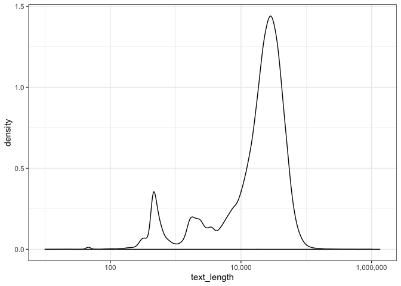
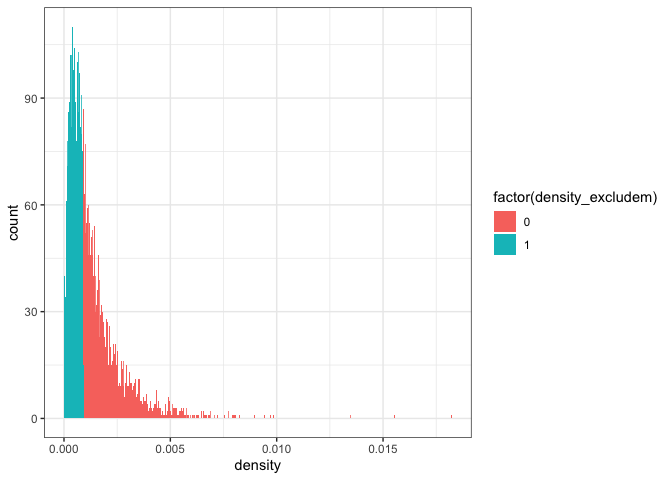
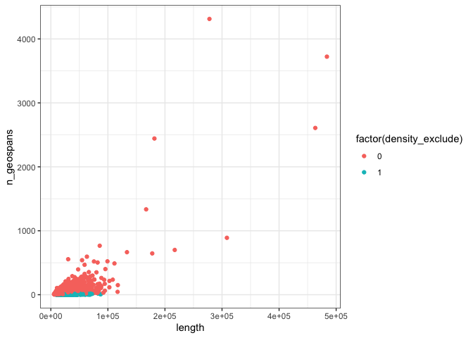
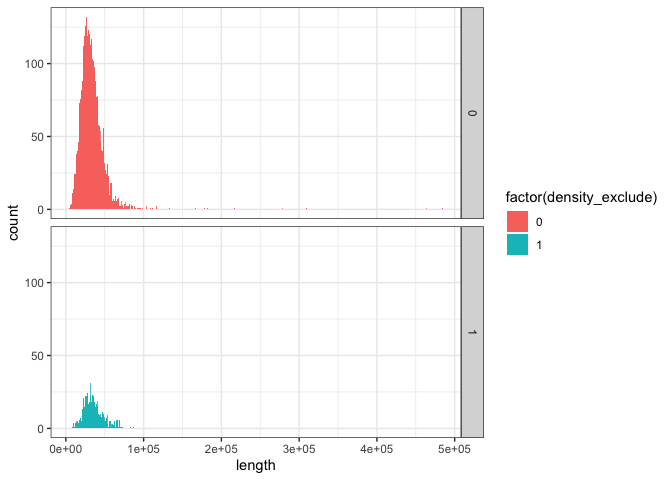
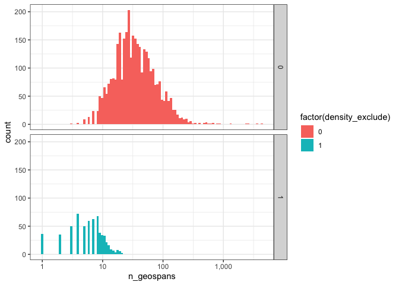

Article Metadata Summaries
================
Toph Allen
4/9/2019

``` r
terms <- read_lines("terms")

articles <- read_csv(here("data", "articles.csv")) %>%
  select(-X1, -id_types, -keywords)
id_types <- read_csv(here("data", "id_types.csv")) %>%
  select(-X1)
keywords <- read_csv(here("data", "keywords.csv")) %>%
  select(-X1)
text_matches <- read_csv(here("data", "text_matches.csv")) %>%
  select(-X1)
geonames <- read_csv(here("data", "geonames.csv")) %>%
  select(-X1)
subset <- read_csv(here("data", "subset.csv")) %>%
  select(-X1)
```

## Prevalence of Text Matches

We searched for four terms in the extracted text of articles, using
MongoDB’s text search capabilities. We think these terms will select
articles which have a fieldwork component over those that don’t. The
terms used are: field work, fieldwork, field study, field site, field
area, study site, study location, study area, research site, research
location, sampling site, sampling location, sampling area.

Matching articles are a smallish subset of the total, 4.429%.

``` r
ktable(articles$any_matches)
```

<table class="table table-hover table-condensed table-responsive" style="width: auto !important; ">

<thead>

<tr>

<th style="text-align:left;">

Var1

</th>

<th style="text-align:right;">

Freq

</th>

</tr>

</thead>

<tbody>

<tr>

<td style="text-align:left;">

FALSE

</td>

<td style="text-align:right;">

95571

</td>

</tr>

<tr>

<td style="text-align:left;">

TRUE

</td>

<td style="text-align:right;">

4429

</td>

</tr>

</tbody>

</table>

``` r
ktable(articles$text_matches) %>% scroll_box(height = "400px")
```

<div style="border: 1px solid #ddd; padding: 0px; overflow-y: scroll; height:400px; ">

<table class="table table-hover table-condensed table-responsive" style="width: auto !important; ">

<thead>

<tr>

<th style="text-align:left;position: sticky; top:0; background-color: #FFFFFF;">

Var1

</th>

<th style="text-align:right;position: sticky; top:0; background-color: #FFFFFF;">

Freq

</th>

</tr>

</thead>

<tbody>

<tr>

<td style="text-align:left;">

\[‘field area’, ‘sampling site’, ‘sampling location’\]

</td>

<td style="text-align:right;">

1

</td>

</tr>

<tr>

<td style="text-align:left;">

\[‘field area’, ‘study area’\]

</td>

<td style="text-align:right;">

6

</td>

</tr>

<tr>

<td style="text-align:left;">

\[‘field area’, ‘study site’, ‘study area’\]

</td>

<td style="text-align:right;">

1

</td>

</tr>

<tr>

<td style="text-align:left;">

\[‘field area’, ‘study site’\]

</td>

<td style="text-align:right;">

4

</td>

</tr>

<tr>

<td style="text-align:left;">

\[‘field area’\]

</td>

<td style="text-align:right;">

59

</td>

</tr>

<tr>

<td style="text-align:left;">

\[‘field site’, ‘research site’\]

</td>

<td style="text-align:right;">

1

</td>

</tr>

<tr>

<td style="text-align:left;">

\[‘field site’, ‘sampling location’\]

</td>

<td style="text-align:right;">

3

</td>

</tr>

<tr>

<td style="text-align:left;">

\[‘field site’, ‘sampling site’, ‘sampling location’\]

</td>

<td style="text-align:right;">

2

</td>

</tr>

<tr>

<td style="text-align:left;">

\[‘field site’, ‘sampling site’\]

</td>

<td style="text-align:right;">

3

</td>

</tr>

<tr>

<td style="text-align:left;">

\[‘field site’, ‘study area’, ‘sampling location’\]

</td>

<td style="text-align:right;">

1

</td>

</tr>

<tr>

<td style="text-align:left;">

\[‘field site’, ‘study area’, ‘sampling site’\]

</td>

<td style="text-align:right;">

1

</td>

</tr>

<tr>

<td style="text-align:left;">

\[‘field site’, ‘study area’\]

</td>

<td style="text-align:right;">

13

</td>

</tr>

<tr>

<td style="text-align:left;">

\[‘field site’, ‘study location’, ‘sampling location’\]

</td>

<td style="text-align:right;">

1

</td>

</tr>

<tr>

<td style="text-align:left;">

\[‘field site’, ‘study site’, ‘research site’\]

</td>

<td style="text-align:right;">

2

</td>

</tr>

<tr>

<td style="text-align:left;">

\[‘field site’, ‘study site’, ‘sampling location’\]

</td>

<td style="text-align:right;">

1

</td>

</tr>

<tr>

<td style="text-align:left;">

\[‘field site’, ‘study site’, ‘sampling site’, ‘sampling area’\]

</td>

<td style="text-align:right;">

1

</td>

</tr>

<tr>

<td style="text-align:left;">

\[‘field site’, ‘study site’, ‘sampling site’, ‘sampling location’\]

</td>

<td style="text-align:right;">

2

</td>

</tr>

<tr>

<td style="text-align:left;">

\[‘field site’, ‘study site’, ‘study area’, ‘sampling site’, ‘sampling
area’\]

</td>

<td style="text-align:right;">

2

</td>

</tr>

<tr>

<td style="text-align:left;">

\[‘field site’, ‘study site’, ‘study area’\]

</td>

<td style="text-align:right;">

11

</td>

</tr>

<tr>

<td style="text-align:left;">

\[‘field site’, ‘study site’, ‘study location’, ‘sampling site’\]

</td>

<td style="text-align:right;">

1

</td>

</tr>

<tr>

<td style="text-align:left;">

\[‘field site’, ‘study site’, ‘study location’\]

</td>

<td style="text-align:right;">

2

</td>

</tr>

<tr>

<td style="text-align:left;">

\[‘field site’, ‘study site’\]

</td>

<td style="text-align:right;">

22

</td>

</tr>

<tr>

<td style="text-align:left;">

\[‘field site’\]

</td>

<td style="text-align:right;">

79

</td>

</tr>

<tr>

<td style="text-align:left;">

\[‘field study’, ‘field area’, ‘study area’, ‘sampling site’\]

</td>

<td style="text-align:right;">

1

</td>

</tr>

<tr>

<td style="text-align:left;">

\[‘field study’, ‘field area’, ‘study area’\]

</td>

<td style="text-align:right;">

1

</td>

</tr>

<tr>

<td style="text-align:left;">

\[‘field study’, ‘field site’, ‘study area’\]

</td>

<td style="text-align:right;">

1

</td>

</tr>

<tr>

<td style="text-align:left;">

\[‘field study’, ‘field site’, ‘study site’, ‘research site’, ‘sampling
location’\]

</td>

<td style="text-align:right;">

1

</td>

</tr>

<tr>

<td style="text-align:left;">

\[‘field study’, ‘field site’, ‘study site’, ‘research site’\]

</td>

<td style="text-align:right;">

1

</td>

</tr>

<tr>

<td style="text-align:left;">

\[‘field study’, ‘field site’, ‘study site’, ‘study area’\]

</td>

<td style="text-align:right;">

3

</td>

</tr>

<tr>

<td style="text-align:left;">

\[‘field study’, ‘field site’, ‘study site’\]

</td>

<td style="text-align:right;">

4

</td>

</tr>

<tr>

<td style="text-align:left;">

\[‘field study’, ‘field site’\]

</td>

<td style="text-align:right;">

7

</td>

</tr>

<tr>

<td style="text-align:left;">

\[‘field study’, ‘research site’, ‘sampling site’\]

</td>

<td style="text-align:right;">

1

</td>

</tr>

<tr>

<td style="text-align:left;">

\[‘field study’, ‘sampling area’\]

</td>

<td style="text-align:right;">

2

</td>

</tr>

<tr>

<td style="text-align:left;">

\[‘field study’, ‘sampling location’\]

</td>

<td style="text-align:right;">

1

</td>

</tr>

<tr>

<td style="text-align:left;">

\[‘field study’, ‘sampling site’, ‘sampling area’\]

</td>

<td style="text-align:right;">

1

</td>

</tr>

<tr>

<td style="text-align:left;">

\[‘field study’, ‘sampling site’\]

</td>

<td style="text-align:right;">

3

</td>

</tr>

<tr>

<td style="text-align:left;">

\[‘field study’, ‘study area’, ‘sampling area’\]

</td>

<td style="text-align:right;">

1

</td>

</tr>

<tr>

<td style="text-align:left;">

\[‘field study’, ‘study area’, ‘sampling location’\]

</td>

<td style="text-align:right;">

2

</td>

</tr>

<tr>

<td style="text-align:left;">

\[‘field study’, ‘study area’, ‘sampling site’\]

</td>

<td style="text-align:right;">

2

</td>

</tr>

<tr>

<td style="text-align:left;">

\[‘field study’, ‘study area’\]

</td>

<td style="text-align:right;">

12

</td>

</tr>

<tr>

<td style="text-align:left;">

\[‘field study’, ‘study location’, ‘study area’\]

</td>

<td style="text-align:right;">

1

</td>

</tr>

<tr>

<td style="text-align:left;">

\[‘field study’, ‘study location’\]

</td>

<td style="text-align:right;">

1

</td>

</tr>

<tr>

<td style="text-align:left;">

\[‘field study’, ‘study site’, ‘research site’\]

</td>

<td style="text-align:right;">

1

</td>

</tr>

<tr>

<td style="text-align:left;">

\[‘field study’, ‘study site’, ‘sampling site’, ‘sampling location’\]

</td>

<td style="text-align:right;">

1

</td>

</tr>

<tr>

<td style="text-align:left;">

\[‘field study’, ‘study site’, ‘sampling site’\]

</td>

<td style="text-align:right;">

2

</td>

</tr>

<tr>

<td style="text-align:left;">

\[‘field study’, ‘study site’, ‘study area’, ‘sampling site’, ‘sampling
area’\]

</td>

<td style="text-align:right;">

1

</td>

</tr>

<tr>

<td style="text-align:left;">

\[‘field study’, ‘study site’, ‘study area’, ‘sampling site’\]

</td>

<td style="text-align:right;">

2

</td>

</tr>

<tr>

<td style="text-align:left;">

\[‘field study’, ‘study site’, ‘study area’\]

</td>

<td style="text-align:right;">

11

</td>

</tr>

<tr>

<td style="text-align:left;">

\[‘field study’, ‘study site’, ‘study location’\]

</td>

<td style="text-align:right;">

1

</td>

</tr>

<tr>

<td style="text-align:left;">

\[‘field study’, ‘study site’\]

</td>

<td style="text-align:right;">

16

</td>

</tr>

<tr>

<td style="text-align:left;">

\[‘field study’\]

</td>

<td style="text-align:right;">

130

</td>

</tr>

<tr>

<td style="text-align:left;">

\[‘field work’, ‘field site’, ‘study site’, ‘study area’, ‘sampling
site’\]

</td>

<td style="text-align:right;">

1

</td>

</tr>

<tr>

<td style="text-align:left;">

\[‘field work’, ‘field site’, ‘study site’, ‘study area’\]

</td>

<td style="text-align:right;">

1

</td>

</tr>

<tr>

<td style="text-align:left;">

\[‘field work’, ‘field study’, ‘field site’, ‘study site’\]

</td>

<td style="text-align:right;">

1

</td>

</tr>

<tr>

<td style="text-align:left;">

\[‘field work’, ‘field study’, ‘field site’\]

</td>

<td style="text-align:right;">

1

</td>

</tr>

<tr>

<td style="text-align:left;">

\[‘field work’, ‘field study’, ‘study area’, ‘sampling site’\]

</td>

<td style="text-align:right;">

1

</td>

</tr>

<tr>

<td style="text-align:left;">

\[‘field work’, ‘field study’, ‘study site’, ‘study area’\]

</td>

<td style="text-align:right;">

2

</td>

</tr>

<tr>

<td style="text-align:left;">

\[‘field work’, ‘field study’, ‘study site’\]

</td>

<td style="text-align:right;">

1

</td>

</tr>

<tr>

<td style="text-align:left;">

\[‘field work’, ‘field study’\]

</td>

<td style="text-align:right;">

2

</td>

</tr>

<tr>

<td style="text-align:left;">

\[‘field work’, ‘fieldwork’, ‘field site’, ‘study area’\]

</td>

<td style="text-align:right;">

1

</td>

</tr>

<tr>

<td style="text-align:left;">

\[‘field work’, ‘fieldwork’, ‘field site’, ‘study site’, ‘study area’\]

</td>

<td style="text-align:right;">

1

</td>

</tr>

<tr>

<td style="text-align:left;">

\[‘field work’, ‘fieldwork’, ‘field site’, ‘study site’\]

</td>

<td style="text-align:right;">

1

</td>

</tr>

<tr>

<td style="text-align:left;">

\[‘field work’, ‘fieldwork’, ‘field site’\]

</td>

<td style="text-align:right;">

6

</td>

</tr>

<tr>

<td style="text-align:left;">

\[‘field work’, ‘fieldwork’, ‘field study’, ‘study area’\]

</td>

<td style="text-align:right;">

1

</td>

</tr>

<tr>

<td style="text-align:left;">

\[‘field work’, ‘fieldwork’, ‘field study’, ‘study site’, ‘study
location’\]

</td>

<td style="text-align:right;">

1

</td>

</tr>

<tr>

<td style="text-align:left;">

\[‘field work’, ‘fieldwork’, ‘research site’\]

</td>

<td style="text-align:right;">

1

</td>

</tr>

<tr>

<td style="text-align:left;">

\[‘field work’, ‘fieldwork’, ‘sampling location’, ‘sampling area’\]

</td>

<td style="text-align:right;">

1

</td>

</tr>

<tr>

<td style="text-align:left;">

\[‘field work’, ‘fieldwork’, ‘study area’\]

</td>

<td style="text-align:right;">

11

</td>

</tr>

<tr>

<td style="text-align:left;">

\[‘field work’, ‘fieldwork’, ‘study site’, ‘sampling site’, ‘sampling
location’\]

</td>

<td style="text-align:right;">

1

</td>

</tr>

<tr>

<td style="text-align:left;">

\[‘field work’, ‘fieldwork’, ‘study site’, ‘study area’\]

</td>

<td style="text-align:right;">

4

</td>

</tr>

<tr>

<td style="text-align:left;">

\[‘field work’, ‘fieldwork’, ‘study site’\]

</td>

<td style="text-align:right;">

2

</td>

</tr>

<tr>

<td style="text-align:left;">

\[‘field work’, ‘fieldwork’\]

</td>

<td style="text-align:right;">

21

</td>

</tr>

<tr>

<td style="text-align:left;">

\[‘field work’, ‘research site’\]

</td>

<td style="text-align:right;">

2

</td>

</tr>

<tr>

<td style="text-align:left;">

\[‘field work’, ‘sampling location’\]

</td>

<td style="text-align:right;">

2

</td>

</tr>

<tr>

<td style="text-align:left;">

\[‘field work’, ‘sampling site’, ‘sampling location’\]

</td>

<td style="text-align:right;">

1

</td>

</tr>

<tr>

<td style="text-align:left;">

\[‘field work’, ‘sampling site’\]

</td>

<td style="text-align:right;">

1

</td>

</tr>

<tr>

<td style="text-align:left;">

\[‘field work’, ‘study area’, ‘research location’\]

</td>

<td style="text-align:right;">

1

</td>

</tr>

<tr>

<td style="text-align:left;">

\[‘field work’, ‘study area’, ‘research site’\]

</td>

<td style="text-align:right;">

1

</td>

</tr>

<tr>

<td style="text-align:left;">

\[‘field work’, ‘study area’, ‘sampling location’\]

</td>

<td style="text-align:right;">

1

</td>

</tr>

<tr>

<td style="text-align:left;">

\[‘field work’, ‘study area’, ‘sampling site’\]

</td>

<td style="text-align:right;">

1

</td>

</tr>

<tr>

<td style="text-align:left;">

\[‘field work’, ‘study area’\]

</td>

<td style="text-align:right;">

41

</td>

</tr>

<tr>

<td style="text-align:left;">

\[‘field work’, ‘study location’, ‘study area’\]

</td>

<td style="text-align:right;">

3

</td>

</tr>

<tr>

<td style="text-align:left;">

\[‘field work’, ‘study location’\]

</td>

<td style="text-align:right;">

1

</td>

</tr>

<tr>

<td style="text-align:left;">

\[‘field work’, ‘study site’, ‘sampling location’, ‘sampling area’\]

</td>

<td style="text-align:right;">

1

</td>

</tr>

<tr>

<td style="text-align:left;">

\[‘field work’, ‘study site’, ‘sampling location’\]

</td>

<td style="text-align:right;">

1

</td>

</tr>

<tr>

<td style="text-align:left;">

\[‘field work’, ‘study site’, ‘sampling site’\]

</td>

<td style="text-align:right;">

1

</td>

</tr>

<tr>

<td style="text-align:left;">

\[‘field work’, ‘study site’, ‘study area’, ‘sampling location’\]

</td>

<td style="text-align:right;">

1

</td>

</tr>

<tr>

<td style="text-align:left;">

\[‘field work’, ‘study site’, ‘study area’, ‘sampling site’\]

</td>

<td style="text-align:right;">

1

</td>

</tr>

<tr>

<td style="text-align:left;">

\[‘field work’, ‘study site’, ‘study area’\]

</td>

<td style="text-align:right;">

19

</td>

</tr>

<tr>

<td style="text-align:left;">

\[‘field work’, ‘study site’, ‘study location’, ‘study area’\]

</td>

<td style="text-align:right;">

1

</td>

</tr>

<tr>

<td style="text-align:left;">

\[‘field work’, ‘study site’, ‘study location’\]

</td>

<td style="text-align:right;">

1

</td>

</tr>

<tr>

<td style="text-align:left;">

\[‘field work’, ‘study site’\]

</td>

<td style="text-align:right;">

28

</td>

</tr>

<tr>

<td style="text-align:left;">

\[‘field work’\]

</td>

<td style="text-align:right;">

143

</td>

</tr>

<tr>

<td style="text-align:left;">

\[‘fieldwork’, ‘field site’, ‘research site’\]

</td>

<td style="text-align:right;">

1

</td>

</tr>

<tr>

<td style="text-align:left;">

\[‘fieldwork’, ‘field site’, ‘sampling area’\]

</td>

<td style="text-align:right;">

1

</td>

</tr>

<tr>

<td style="text-align:left;">

\[‘fieldwork’, ‘field site’, ‘sampling location’\]

</td>

<td style="text-align:right;">

1

</td>

</tr>

<tr>

<td style="text-align:left;">

\[‘fieldwork’, ‘field site’, ‘study area’\]

</td>

<td style="text-align:right;">

1

</td>

</tr>

<tr>

<td style="text-align:left;">

\[‘fieldwork’, ‘field site’, ‘study site’, ‘research location’\]

</td>

<td style="text-align:right;">

1

</td>

</tr>

<tr>

<td style="text-align:left;">

\[‘fieldwork’, ‘field site’, ‘study site’\]

</td>

<td style="text-align:right;">

2

</td>

</tr>

<tr>

<td style="text-align:left;">

\[‘fieldwork’, ‘field site’\]

</td>

<td style="text-align:right;">

5

</td>

</tr>

<tr>

<td style="text-align:left;">

\[‘fieldwork’, ‘field study’, ‘field site’, ‘study site’, ‘study area’\]

</td>

<td style="text-align:right;">

1

</td>

</tr>

<tr>

<td style="text-align:left;">

\[‘fieldwork’, ‘field study’, ‘study area’\]

</td>

<td style="text-align:right;">

2

</td>

</tr>

<tr>

<td style="text-align:left;">

\[‘fieldwork’, ‘field study’, ‘study site’, ‘study area’, ‘sampling
location’\]

</td>

<td style="text-align:right;">

1

</td>

</tr>

<tr>

<td style="text-align:left;">

\[‘fieldwork’, ‘field study’, ‘study site’, ‘study area’\]

</td>

<td style="text-align:right;">

3

</td>

</tr>

<tr>

<td style="text-align:left;">

\[‘fieldwork’, ‘field study’\]

</td>

<td style="text-align:right;">

4

</td>

</tr>

<tr>

<td style="text-align:left;">

\[‘fieldwork’, ‘research site’\]

</td>

<td style="text-align:right;">

3

</td>

</tr>

<tr>

<td style="text-align:left;">

\[‘fieldwork’, ‘sampling area’\]

</td>

<td style="text-align:right;">

1

</td>

</tr>

<tr>

<td style="text-align:left;">

\[‘fieldwork’, ‘sampling location’\]

</td>

<td style="text-align:right;">

5

</td>

</tr>

<tr>

<td style="text-align:left;">

\[‘fieldwork’, ‘sampling site’\]

</td>

<td style="text-align:right;">

1

</td>

</tr>

<tr>

<td style="text-align:left;">

\[‘fieldwork’, ‘study area’, ‘research site’\]

</td>

<td style="text-align:right;">

1

</td>

</tr>

<tr>

<td style="text-align:left;">

\[‘fieldwork’, ‘study area’, ‘sampling area’\]

</td>

<td style="text-align:right;">

2

</td>

</tr>

<tr>

<td style="text-align:left;">

\[‘fieldwork’, ‘study area’, ‘sampling location’\]

</td>

<td style="text-align:right;">

2

</td>

</tr>

<tr>

<td style="text-align:left;">

\[‘fieldwork’, ‘study area’, ‘sampling site’, ‘sampling area’\]

</td>

<td style="text-align:right;">

1

</td>

</tr>

<tr>

<td style="text-align:left;">

\[‘fieldwork’, ‘study area’, ‘sampling site’, ‘sampling location’\]

</td>

<td style="text-align:right;">

2

</td>

</tr>

<tr>

<td style="text-align:left;">

\[‘fieldwork’, ‘study area’, ‘sampling site’\]

</td>

<td style="text-align:right;">

2

</td>

</tr>

<tr>

<td style="text-align:left;">

\[‘fieldwork’, ‘study area’\]

</td>

<td style="text-align:right;">

42

</td>

</tr>

<tr>

<td style="text-align:left;">

\[‘fieldwork’, ‘study location’, ‘research site’\]

</td>

<td style="text-align:right;">

1

</td>

</tr>

<tr>

<td style="text-align:left;">

\[‘fieldwork’, ‘study location’, ‘study area’, ‘research site’\]

</td>

<td style="text-align:right;">

1

</td>

</tr>

<tr>

<td style="text-align:left;">

\[‘fieldwork’, ‘study location’\]

</td>

<td style="text-align:right;">

1

</td>

</tr>

<tr>

<td style="text-align:left;">

\[‘fieldwork’, ‘study site’, ‘sampling site’, ‘sampling area’\]

</td>

<td style="text-align:right;">

1

</td>

</tr>

<tr>

<td style="text-align:left;">

\[‘fieldwork’, ‘study site’, ‘sampling site’, ‘sampling location’\]

</td>

<td style="text-align:right;">

1

</td>

</tr>

<tr>

<td style="text-align:left;">

\[‘fieldwork’, ‘study site’, ‘sampling site’\]

</td>

<td style="text-align:right;">

2

</td>

</tr>

<tr>

<td style="text-align:left;">

\[‘fieldwork’, ‘study site’, ‘study area’, ‘research site’\]

</td>

<td style="text-align:right;">

1

</td>

</tr>

<tr>

<td style="text-align:left;">

\[‘fieldwork’, ‘study site’, ‘study area’, ‘sampling location’\]

</td>

<td style="text-align:right;">

1

</td>

</tr>

<tr>

<td style="text-align:left;">

\[‘fieldwork’, ‘study site’, ‘study area’, ‘sampling site’, ‘sampling
area’\]

</td>

<td style="text-align:right;">

1

</td>

</tr>

<tr>

<td style="text-align:left;">

\[‘fieldwork’, ‘study site’, ‘study area’, ‘sampling site’\]

</td>

<td style="text-align:right;">

1

</td>

</tr>

<tr>

<td style="text-align:left;">

\[‘fieldwork’, ‘study site’, ‘study area’\]

</td>

<td style="text-align:right;">

24

</td>

</tr>

<tr>

<td style="text-align:left;">

\[‘fieldwork’, ‘study site’, ‘study location’, ‘study area’, ‘sampling
location’\]

</td>

<td style="text-align:right;">

1

</td>

</tr>

<tr>

<td style="text-align:left;">

\[‘fieldwork’, ‘study site’, ‘study location’, ‘study area’\]

</td>

<td style="text-align:right;">

1

</td>

</tr>

<tr>

<td style="text-align:left;">

\[‘fieldwork’, ‘study site’, ‘study location’\]

</td>

<td style="text-align:right;">

1

</td>

</tr>

<tr>

<td style="text-align:left;">

\[‘fieldwork’, ‘study site’\]

</td>

<td style="text-align:right;">

27

</td>

</tr>

<tr>

<td style="text-align:left;">

\[‘fieldwork’\]

</td>

<td style="text-align:right;">

233

</td>

</tr>

<tr>

<td style="text-align:left;">

\[‘research location’\]

</td>

<td style="text-align:right;">

6

</td>

</tr>

<tr>

<td style="text-align:left;">

\[‘research site’, ‘research location’\]

</td>

<td style="text-align:right;">

1

</td>

</tr>

<tr>

<td style="text-align:left;">

\[‘research site’, ‘sampling site’\]

</td>

<td style="text-align:right;">

1

</td>

</tr>

<tr>

<td style="text-align:left;">

\[‘research site’\]

</td>

<td style="text-align:right;">

70

</td>

</tr>

<tr>

<td style="text-align:left;">

\[‘sampling area’\]

</td>

<td style="text-align:right;">

64

</td>

</tr>

<tr>

<td style="text-align:left;">

\[‘sampling location’, ‘sampling area’\]

</td>

<td style="text-align:right;">

8

</td>

</tr>

<tr>

<td style="text-align:left;">

\[‘sampling location’\]

</td>

<td style="text-align:right;">

122

</td>

</tr>

<tr>

<td style="text-align:left;">

\[‘sampling site’, ‘sampling area’\]

</td>

<td style="text-align:right;">

15

</td>

</tr>

<tr>

<td style="text-align:left;">

\[‘sampling site’, ‘sampling location’, ‘sampling area’\]

</td>

<td style="text-align:right;">

2

</td>

</tr>

<tr>

<td style="text-align:left;">

\[‘sampling site’, ‘sampling location’\]

</td>

<td style="text-align:right;">

53

</td>

</tr>

<tr>

<td style="text-align:left;">

\[‘sampling site’\]

</td>

<td style="text-align:right;">

243

</td>

</tr>

<tr>

<td style="text-align:left;">

\[‘study area’, ‘research site’, ‘sampling area’\]

</td>

<td style="text-align:right;">

1

</td>

</tr>

<tr>

<td style="text-align:left;">

\[‘study area’, ‘research site’, ‘sampling location’\]

</td>

<td style="text-align:right;">

1

</td>

</tr>

<tr>

<td style="text-align:left;">

\[‘study area’, ‘research site’, ‘sampling site’\]

</td>

<td style="text-align:right;">

1

</td>

</tr>

<tr>

<td style="text-align:left;">

\[‘study area’, ‘research site’\]

</td>

<td style="text-align:right;">

4

</td>

</tr>

<tr>

<td style="text-align:left;">

\[‘study area’, ‘sampling area’\]

</td>

<td style="text-align:right;">

14

</td>

</tr>

<tr>

<td style="text-align:left;">

\[‘study area’, ‘sampling location’, ‘sampling area’\]

</td>

<td style="text-align:right;">

5

</td>

</tr>

<tr>

<td style="text-align:left;">

\[‘study area’, ‘sampling location’\]

</td>

<td style="text-align:right;">

28

</td>

</tr>

<tr>

<td style="text-align:left;">

\[‘study area’, ‘sampling site’, ‘sampling area’\]

</td>

<td style="text-align:right;">

8

</td>

</tr>

<tr>

<td style="text-align:left;">

\[‘study area’, ‘sampling site’, ‘sampling location’, ‘sampling area’\]

</td>

<td style="text-align:right;">

2

</td>

</tr>

<tr>

<td style="text-align:left;">

\[‘study area’, ‘sampling site’, ‘sampling location’\]

</td>

<td style="text-align:right;">

14

</td>

</tr>

<tr>

<td style="text-align:left;">

\[‘study area’, ‘sampling site’\]

</td>

<td style="text-align:right;">

58

</td>

</tr>

<tr>

<td style="text-align:left;">

\[‘study area’\]

</td>

<td style="text-align:right;">

1009

</td>

</tr>

<tr>

<td style="text-align:left;">

\[‘study location’, ‘research site’\]

</td>

<td style="text-align:right;">

2

</td>

</tr>

<tr>

<td style="text-align:left;">

\[‘study location’, ‘sampling site’, ‘sampling location’\]

</td>

<td style="text-align:right;">

2

</td>

</tr>

<tr>

<td style="text-align:left;">

\[‘study location’, ‘sampling site’\]

</td>

<td style="text-align:right;">

2

</td>

</tr>

<tr>

<td style="text-align:left;">

\[‘study location’, ‘study area’, ‘sampling site’, ‘sampling location’\]

</td>

<td style="text-align:right;">

2

</td>

</tr>

<tr>

<td style="text-align:left;">

\[‘study location’, ‘study area’\]

</td>

<td style="text-align:right;">

22

</td>

</tr>

<tr>

<td style="text-align:left;">

\[‘study location’\]

</td>

<td style="text-align:right;">

135

</td>

</tr>

<tr>

<td style="text-align:left;">

\[‘study site’, ‘research location’, ‘sampling location’\]

</td>

<td style="text-align:right;">

1

</td>

</tr>

<tr>

<td style="text-align:left;">

\[‘study site’, ‘research location’\]

</td>

<td style="text-align:right;">

3

</td>

</tr>

<tr>

<td style="text-align:left;">

\[‘study site’, ‘research site’, ‘sampling location’\]

</td>

<td style="text-align:right;">

1

</td>

</tr>

<tr>

<td style="text-align:left;">

\[‘study site’, ‘research site’, ‘sampling site’\]

</td>

<td style="text-align:right;">

1

</td>

</tr>

<tr>

<td style="text-align:left;">

\[‘study site’, ‘research site’\]

</td>

<td style="text-align:right;">

17

</td>

</tr>

<tr>

<td style="text-align:left;">

\[‘study site’, ‘sampling area’\]

</td>

<td style="text-align:right;">

3

</td>

</tr>

<tr>

<td style="text-align:left;">

\[‘study site’, ‘sampling location’, ‘sampling area’\]

</td>

<td style="text-align:right;">

1

</td>

</tr>

<tr>

<td style="text-align:left;">

\[‘study site’, ‘sampling location’\]

</td>

<td style="text-align:right;">

8

</td>

</tr>

<tr>

<td style="text-align:left;">

\[‘study site’, ‘sampling site’, ‘sampling area’\]

</td>

<td style="text-align:right;">

2

</td>

</tr>

<tr>

<td style="text-align:left;">

\[‘study site’, ‘sampling site’, ‘sampling location’, ‘sampling area’\]

</td>

<td style="text-align:right;">

1

</td>

</tr>

<tr>

<td style="text-align:left;">

\[‘study site’, ‘sampling site’, ‘sampling location’\]

</td>

<td style="text-align:right;">

10

</td>

</tr>

<tr>

<td style="text-align:left;">

\[‘study site’, ‘sampling site’\]

</td>

<td style="text-align:right;">

40

</td>

</tr>

<tr>

<td style="text-align:left;">

\[‘study site’, ‘study area’, ‘research site’\]

</td>

<td style="text-align:right;">

4

</td>

</tr>

<tr>

<td style="text-align:left;">

\[‘study site’, ‘study area’, ‘sampling area’\]

</td>

<td style="text-align:right;">

10

</td>

</tr>

<tr>

<td style="text-align:left;">

\[‘study site’, ‘study area’, ‘sampling location’, ‘sampling area’\]

</td>

<td style="text-align:right;">

1

</td>

</tr>

<tr>

<td style="text-align:left;">

\[‘study site’, ‘study area’, ‘sampling location’\]

</td>

<td style="text-align:right;">

5

</td>

</tr>

<tr>

<td style="text-align:left;">

\[‘study site’, ‘study area’, ‘sampling site’, ‘sampling area’\]

</td>

<td style="text-align:right;">

4

</td>

</tr>

<tr>

<td style="text-align:left;">

\[‘study site’, ‘study area’, ‘sampling site’, ‘sampling location’,
‘sampling area’\]

</td>

<td style="text-align:right;">

2

</td>

</tr>

<tr>

<td style="text-align:left;">

\[‘study site’, ‘study area’, ‘sampling site’, ‘sampling location’\]

</td>

<td style="text-align:right;">

2

</td>

</tr>

<tr>

<td style="text-align:left;">

\[‘study site’, ‘study area’, ‘sampling site’\]

</td>

<td style="text-align:right;">

32

</td>

</tr>

<tr>

<td style="text-align:left;">

\[‘study site’, ‘study area’\]

</td>

<td style="text-align:right;">

232

</td>

</tr>

<tr>

<td style="text-align:left;">

\[‘study site’, ‘study location’, ‘research location’, ‘sampling
location’\]

</td>

<td style="text-align:right;">

1

</td>

</tr>

<tr>

<td style="text-align:left;">

\[‘study site’, ‘study location’, ‘sampling site’, ‘sampling area’\]

</td>

<td style="text-align:right;">

1

</td>

</tr>

<tr>

<td style="text-align:left;">

\[‘study site’, ‘study location’, ‘sampling site’\]

</td>

<td style="text-align:right;">

1

</td>

</tr>

<tr>

<td style="text-align:left;">

\[‘study site’, ‘study location’, ‘study area’, ‘sampling area’\]

</td>

<td style="text-align:right;">

1

</td>

</tr>

<tr>

<td style="text-align:left;">

\[‘study site’, ‘study location’, ‘study area’\]

</td>

<td style="text-align:right;">

3

</td>

</tr>

<tr>

<td style="text-align:left;">

\[‘study site’, ‘study location’\]

</td>

<td style="text-align:right;">

21

</td>

</tr>

<tr>

<td style="text-align:left;">

\[‘study site’\]

</td>

<td style="text-align:right;">

999

</td>

</tr>

</tbody>

</table>

</div>

``` r
text_matches %>%
  filter(!is.na(text_matches)) %>%
  ggplot(aes(x = factor(text_matches))) +
  geom_bar(stat = "count") +
  theme_bw()
```

<!-- -->

## Examining characteristics of the subset

I pulled a few pieces of metadata for our subset of articles. These
include:

  - What type of article is it?
  - Does it have a `<body>` tag?
  - How long is it?
  - Associated keywords
  - What types of document identifiers does it have?

### Article types

There are many article types, but only a few which are widely used.

``` r
articles %<>%
  mutate(article_type = fct_infreq(article_type))
ktable(articles$article_type) %>% scroll_box(height = "400px")
```

<div style="border: 1px solid #ddd; padding: 0px; overflow-y: scroll; height:400px; ">

<table class="table table-hover table-condensed table-responsive" style="width: auto !important; ">

<thead>

<tr>

<th style="text-align:left;position: sticky; top:0; background-color: #FFFFFF;">

Var1

</th>

<th style="text-align:right;position: sticky; top:0; background-color: #FFFFFF;">

Freq

</th>

</tr>

</thead>

<tbody>

<tr>

<td style="text-align:left;">

research-article

</td>

<td style="text-align:right;">

72488

</td>

</tr>

<tr>

<td style="text-align:left;">

review-article

</td>

<td style="text-align:right;">

6790

</td>

</tr>

<tr>

<td style="text-align:left;">

case-report

</td>

<td style="text-align:right;">

4570

</td>

</tr>

<tr>

<td style="text-align:left;">

other

</td>

<td style="text-align:right;">

3619

</td>

</tr>

<tr>

<td style="text-align:left;">

abstract

</td>

<td style="text-align:right;">

2673

</td>

</tr>

<tr>

<td style="text-align:left;">

brief-report

</td>

<td style="text-align:right;">

1618

</td>

</tr>

<tr>

<td style="text-align:left;">

letter

</td>

<td style="text-align:right;">

1606

</td>

</tr>

<tr>

<td style="text-align:left;">

editorial

</td>

<td style="text-align:right;">

1516

</td>

</tr>

<tr>

<td style="text-align:left;">

book-review

</td>

<td style="text-align:right;">

1496

</td>

</tr>

<tr>

<td style="text-align:left;">

correction

</td>

<td style="text-align:right;">

1303

</td>

</tr>

<tr>

<td style="text-align:left;">

article-commentary

</td>

<td style="text-align:right;">

434

</td>

</tr>

<tr>

<td style="text-align:left;">

news

</td>

<td style="text-align:right;">

418

</td>

</tr>

<tr>

<td style="text-align:left;">

meeting-report

</td>

<td style="text-align:right;">

333

</td>

</tr>

<tr>

<td style="text-align:left;">

discussion

</td>

<td style="text-align:right;">

181

</td>

</tr>

<tr>

<td style="text-align:left;">

protocol

</td>

<td style="text-align:right;">

154

</td>

</tr>

<tr>

<td style="text-align:left;">

obituary

</td>

<td style="text-align:right;">

142

</td>

</tr>

<tr>

<td style="text-align:left;">

product-review

</td>

<td style="text-align:right;">

98

</td>

</tr>

<tr>

<td style="text-align:left;">

rapid-communication

</td>

<td style="text-align:right;">

94

</td>

</tr>

<tr>

<td style="text-align:left;">

in-brief

</td>

<td style="text-align:right;">

80

</td>

</tr>

<tr>

<td style="text-align:left;">

reply

</td>

<td style="text-align:right;">

74

</td>

</tr>

<tr>

<td style="text-align:left;">

methods-article

</td>

<td style="text-align:right;">

65

</td>

</tr>

<tr>

<td style="text-align:left;">

retraction

</td>

<td style="text-align:right;">

56

</td>

</tr>

<tr>

<td style="text-align:left;">

systematic-review

</td>

<td style="text-align:right;">

41

</td>

</tr>

<tr>

<td style="text-align:left;">

data-paper

</td>

<td style="text-align:right;">

39

</td>

</tr>

<tr>

<td style="text-align:left;">

introduction

</td>

<td style="text-align:right;">

36

</td>

</tr>

<tr>

<td style="text-align:left;">

report

</td>

<td style="text-align:right;">

18

</td>

</tr>

<tr>

<td style="text-align:left;">

announcement

</td>

<td style="text-align:right;">

17

</td>

</tr>

<tr>

<td style="text-align:left;">

addendum

</td>

<td style="text-align:right;">

14

</td>

</tr>

<tr>

<td style="text-align:left;">

calendar

</td>

<td style="text-align:right;">

10

</td>

</tr>

<tr>

<td style="text-align:left;">

books-received

</td>

<td style="text-align:right;">

5

</td>

</tr>

<tr>

<td style="text-align:left;">

expression-of-concern

</td>

<td style="text-align:right;">

5

</td>

</tr>

<tr>

<td style="text-align:left;">

oration

</td>

<td style="text-align:right;">

4

</td>

</tr>

<tr>

<td style="text-align:left;">

index

</td>

<td style="text-align:right;">

3

</td>

</tr>

</tbody>

</table>

</div>

``` r
articles %>% 
  group_by(article_type) %>%
  mutate(n = n()) %>%
  filter(n > 50) %>%
  ungroup() %>%
  ggplot(aes(x = factor(article_type))) +
  geom_bar() +
  theme_bw() + theme(axis.text.x = element_text(angle = 45, hjust = 1))
```

<!-- -->

Does the usage of these differ between the fieldwork subset?

``` r
articles %>% 
  group_by(any_matches) %>%
  mutate(n_matches = n()) %>%
  group_by(any_matches, article_type) %>%
  summarize(type_freq = (n() / n_matches)[1]) %>%
  ungroup() %>%
  group_by(article_type) %>%
  filter(n() > 1) %>%
  ungroup() %>%
  ggplot(aes(x = factor(article_type), y = type_freq, fill = any_matches)) +
  geom_col(position = "dodge") +
  theme_bw() + theme(axis.text.x = element_text(angle = 45, hjust = 1))
```

<!-- -->

There are more research articles, and fewer of everything else.

### Presence of `<body>` tag

``` r
ktable(articles$has_body)
```

<table class="table table-hover table-condensed table-responsive" style="width: auto !important; ">

<thead>

<tr>

<th style="text-align:left;">

Var1

</th>

<th style="text-align:right;">

Freq

</th>

</tr>

</thead>

<tbody>

<tr>

<td style="text-align:left;">

FALSE

</td>

<td style="text-align:right;">

9078

</td>

</tr>

<tr>

<td style="text-align:left;">

TRUE

</td>

<td style="text-align:right;">

90922

</td>

</tr>

</tbody>

</table>

``` r
ktable(articles$article_type, articles$has_body) %>% scroll_box(height = "400px")
```

<div style="border: 1px solid #ddd; padding: 0px; overflow-y: scroll; height:400px; ">

<table class="table table-hover table-condensed table-responsive" style="width: auto !important; ">

<thead>

<tr>

<th style="text-align:left;position: sticky; top:0; background-color: #FFFFFF;">

</th>

<th style="text-align:right;position: sticky; top:0; background-color: #FFFFFF;">

FALSE

</th>

<th style="text-align:right;position: sticky; top:0; background-color: #FFFFFF;">

TRUE

</th>

</tr>

</thead>

<tbody>

<tr>

<td style="text-align:left;">

research-article

</td>

<td style="text-align:right;">

4125

</td>

<td style="text-align:right;">

68363

</td>

</tr>

<tr>

<td style="text-align:left;">

review-article

</td>

<td style="text-align:right;">

226

</td>

<td style="text-align:right;">

6564

</td>

</tr>

<tr>

<td style="text-align:left;">

case-report

</td>

<td style="text-align:right;">

27

</td>

<td style="text-align:right;">

4543

</td>

</tr>

<tr>

<td style="text-align:left;">

other

</td>

<td style="text-align:right;">

2099

</td>

<td style="text-align:right;">

1520

</td>

</tr>

<tr>

<td style="text-align:left;">

abstract

</td>

<td style="text-align:right;">

543

</td>

<td style="text-align:right;">

2130

</td>

</tr>

<tr>

<td style="text-align:left;">

brief-report

</td>

<td style="text-align:right;">

28

</td>

<td style="text-align:right;">

1590

</td>

</tr>

<tr>

<td style="text-align:left;">

letter

</td>

<td style="text-align:right;">

283

</td>

<td style="text-align:right;">

1323

</td>

</tr>

<tr>

<td style="text-align:left;">

editorial

</td>

<td style="text-align:right;">

175

</td>

<td style="text-align:right;">

1341

</td>

</tr>

<tr>

<td style="text-align:left;">

book-review

</td>

<td style="text-align:right;">

989

</td>

<td style="text-align:right;">

507

</td>

</tr>

<tr>

<td style="text-align:left;">

correction

</td>

<td style="text-align:right;">

53

</td>

<td style="text-align:right;">

1250

</td>

</tr>

<tr>

<td style="text-align:left;">

article-commentary

</td>

<td style="text-align:right;">

6

</td>

<td style="text-align:right;">

428

</td>

</tr>

<tr>

<td style="text-align:left;">

news

</td>

<td style="text-align:right;">

174

</td>

<td style="text-align:right;">

244

</td>

</tr>

<tr>

<td style="text-align:left;">

meeting-report

</td>

<td style="text-align:right;">

195

</td>

<td style="text-align:right;">

138

</td>

</tr>

<tr>

<td style="text-align:left;">

discussion

</td>

<td style="text-align:right;">

4

</td>

<td style="text-align:right;">

177

</td>

</tr>

<tr>

<td style="text-align:left;">

protocol

</td>

<td style="text-align:right;">

0

</td>

<td style="text-align:right;">

154

</td>

</tr>

<tr>

<td style="text-align:left;">

obituary

</td>

<td style="text-align:right;">

125

</td>

<td style="text-align:right;">

17

</td>

</tr>

<tr>

<td style="text-align:left;">

product-review

</td>

<td style="text-align:right;">

0

</td>

<td style="text-align:right;">

98

</td>

</tr>

<tr>

<td style="text-align:left;">

rapid-communication

</td>

<td style="text-align:right;">

0

</td>

<td style="text-align:right;">

94

</td>

</tr>

<tr>

<td style="text-align:left;">

in-brief

</td>

<td style="text-align:right;">

2

</td>

<td style="text-align:right;">

78

</td>

</tr>

<tr>

<td style="text-align:left;">

reply

</td>

<td style="text-align:right;">

10

</td>

<td style="text-align:right;">

64

</td>

</tr>

<tr>

<td style="text-align:left;">

methods-article

</td>

<td style="text-align:right;">

0

</td>

<td style="text-align:right;">

65

</td>

</tr>

<tr>

<td style="text-align:left;">

retraction

</td>

<td style="text-align:right;">

0

</td>

<td style="text-align:right;">

56

</td>

</tr>

<tr>

<td style="text-align:left;">

systematic-review

</td>

<td style="text-align:right;">

0

</td>

<td style="text-align:right;">

41

</td>

</tr>

<tr>

<td style="text-align:left;">

data-paper

</td>

<td style="text-align:right;">

0

</td>

<td style="text-align:right;">

39

</td>

</tr>

<tr>

<td style="text-align:left;">

introduction

</td>

<td style="text-align:right;">

4

</td>

<td style="text-align:right;">

32

</td>

</tr>

<tr>

<td style="text-align:left;">

report

</td>

<td style="text-align:right;">

0

</td>

<td style="text-align:right;">

18

</td>

</tr>

<tr>

<td style="text-align:left;">

announcement

</td>

<td style="text-align:right;">

0

</td>

<td style="text-align:right;">

17

</td>

</tr>

<tr>

<td style="text-align:left;">

addendum

</td>

<td style="text-align:right;">

0

</td>

<td style="text-align:right;">

14

</td>

</tr>

<tr>

<td style="text-align:left;">

calendar

</td>

<td style="text-align:right;">

4

</td>

<td style="text-align:right;">

6

</td>

</tr>

<tr>

<td style="text-align:left;">

books-received

</td>

<td style="text-align:right;">

0

</td>

<td style="text-align:right;">

5

</td>

</tr>

<tr>

<td style="text-align:left;">

expression-of-concern

</td>

<td style="text-align:right;">

0

</td>

<td style="text-align:right;">

5

</td>

</tr>

<tr>

<td style="text-align:left;">

oration

</td>

<td style="text-align:right;">

3

</td>

<td style="text-align:right;">

1

</td>

</tr>

<tr>

<td style="text-align:left;">

index

</td>

<td style="text-align:right;">

3

</td>

<td style="text-align:right;">

0

</td>

</tr>

</tbody>

</table>

</div>

### Length

``` r
types <- articles %>%
  group_by(any_matches) %>%
  mutate(match_n = n()) %>%
  group_by(article_type) %>%
  mutate(type_n = n()) %>%
  group_by(any_matches, article_type) %>%
  summarize(match_x_type = n(),
            match_n = match_n[1],
            type_n = type_n[1]) %>%
  ungroup() %>%
  mutate(x_over_match = match_x_type / match_n,
         x_over_type = match_x_type / type_n)

type_filter <- types %>%
  filter(x_over_match > 0.005) %>%
  group_by(article_type) %>%
  filter(n() > 1) %>%
  pull(article_type) %>%
  unique()
```

``` r
ggplot(articles, aes(x = text_length)) +
  geom_density() +
  scale_x_log10(labels = comma) +
  theme_bw()
```

<!-- -->

``` r
ggplot(articles, aes(x = text_length, fill = any_matches)) +
  geom_density(alpha = 0.5) +
  scale_x_log10(labels = comma) +
  theme_bw()
```

<!-- -->

``` r
articles %>%
  group_by(article_type) %>%
  filter(n() > 100) %>%
  ggplot(aes(x = text_length, fill = article_type)) +
  geom_density(alpha = 0.25) +
  scale_x_log10(labels = comma) +
  theme_bw()
```

<!-- -->

``` r
articles %>%
  filter(article_type %in% type_filter) %>%
  ggplot(aes(x = text_length, fill = article_type)) +
  geom_density() +
  scale_x_log10(labels = comma) +
  facet_grid(article_type ~ any_matches) +
  theme_bw()
```

<!-- -->

### Usage of Keywords

``` r
keywords_per_paper <- keywords %>%
  group_by(id) %>%
  summarize(any_matches = unique(any_matches),
            n = n())
```

A total of 51182 papers out of 100000 (51.182%) had keywords.

For those matching fieldwork terms:

``` r
k <- keywords_per_paper %>%
  filter(any_matches == TRUE) %>%
  nrow()
nk <- articles %>%
  filter(any_matches == TRUE) %>%
  nrow()

k / nk * 100
```

    ## [1] 57.66539

For those not matching fieldwork terms:

``` r
k <- keywords_per_paper %>%
  filter(any_matches == FALSE) %>%
  nrow()
nk <- articles %>%
  filter(any_matches == FALSE) %>%
  nrow()

k / nk * 100
```

    ## [1] 50.88154

These are the top twenty-five keywords used in all documents:

``` r
keyword_summary <- keywords %>%
  group_by(keywords) %>%
  summarize(n = n()) %>%
  arrange(-n) %>%
  head(25)

knitr::kable(keyword_summary) %>%
  kable_styling(bootstrap_options = c("hover", "condensed", "responsive"),
                full_width = FALSE,
                position = "left") %>%
  scroll_box(height = "400px")
```

<div style="border: 1px solid #ddd; padding: 0px; overflow-y: scroll; height:400px; ">

<table class="table table-hover table-condensed table-responsive" style="width: auto !important; ">

<thead>

<tr>

<th style="text-align:left;position: sticky; top:0; background-color: #FFFFFF;">

keywords

</th>

<th style="text-align:right;position: sticky; top:0; background-color: #FFFFFF;">

n

</th>

</tr>

</thead>

<tbody>

<tr>

<td style="text-align:left;">

apoptosis

</td>

<td style="text-align:right;">

377

</td>

</tr>

<tr>

<td style="text-align:left;">

inflammation

</td>

<td style="text-align:right;">

342

</td>

</tr>

<tr>

<td style="text-align:left;">

breast cancer

</td>

<td style="text-align:right;">

314

</td>

</tr>

<tr>

<td style="text-align:left;">

cancer

</td>

<td style="text-align:right;">

313

</td>

</tr>

<tr>

<td style="text-align:left;">

HIV

</td>

<td style="text-align:right;">

299

</td>

</tr>

<tr>

<td style="text-align:left;">

prognosis

</td>

<td style="text-align:right;">

257

</td>

</tr>

<tr>

<td style="text-align:left;">

Breast cancer

</td>

<td style="text-align:right;">

245

</td>

</tr>

<tr>

<td style="text-align:left;">

obesity

</td>

<td style="text-align:right;">

244

</td>

</tr>

<tr>

<td style="text-align:left;">

Epidemiology

</td>

<td style="text-align:right;">

236

</td>

</tr>

<tr>

<td style="text-align:left;">

epidemiology

</td>

<td style="text-align:right;">

219

</td>

</tr>

<tr>

<td style="text-align:left;">

oxidative stress

</td>

<td style="text-align:right;">

219

</td>

</tr>

<tr>

<td style="text-align:left;">

meta-analysis

</td>

<td style="text-align:right;">

216

</td>

</tr>

<tr>

<td style="text-align:left;">

Obesity

</td>

<td style="text-align:right;">

214

</td>

</tr>

<tr>

<td style="text-align:left;">

Inflammation

</td>

<td style="text-align:right;">

209

</td>

</tr>

<tr>

<td style="text-align:left;">

children

</td>

<td style="text-align:right;">

196

</td>

</tr>

<tr>

<td style="text-align:left;">

aging

</td>

<td style="text-align:right;">

190

</td>

</tr>

<tr>

<td style="text-align:left;">

depression

</td>

<td style="text-align:right;">

186

</td>

</tr>

<tr>

<td style="text-align:left;">

colorectal cancer

</td>

<td style="text-align:right;">

182

</td>

</tr>

<tr>

<td style="text-align:left;">

Cancer

</td>

<td style="text-align:right;">

174

</td>

</tr>

<tr>

<td style="text-align:left;">

Children

</td>

<td style="text-align:right;">

174

</td>

</tr>

<tr>

<td style="text-align:left;">

Alzheimer’s disease

</td>

<td style="text-align:right;">

172

</td>

</tr>

<tr>

<td style="text-align:left;">

Apoptosis

</td>

<td style="text-align:right;">

171

</td>

</tr>

<tr>

<td style="text-align:left;">

metastasis

</td>

<td style="text-align:right;">

165

</td>

</tr>

<tr>

<td style="text-align:left;">

Prognosis

</td>

<td style="text-align:right;">

165

</td>

</tr>

<tr>

<td style="text-align:left;">

Iran

</td>

<td style="text-align:right;">

158

</td>

</tr>

</tbody>

</table>

</div>

For those matching fieldwork terms:

``` r
fw_keyword_summary <- keywords %>%
  filter(any_matches == TRUE) %>%
  group_by(keywords) %>%
  summarize(n = n()) %>%
  arrange(-n) %>%
  head(25)

knitr::kable(fw_keyword_summary) %>%
  kable_styling(bootstrap_options = c("hover", "condensed", "responsive"),
                full_width = FALSE,
                position = "left") %>%
  scroll_box(height = "400px")
```

<div style="border: 1px solid #ddd; padding: 0px; overflow-y: scroll; height:400px; ">

<table class="table table-hover table-condensed table-responsive" style="width: auto !important; ">

<thead>

<tr>

<th style="text-align:left;position: sticky; top:0; background-color: #FFFFFF;">

keywords

</th>

<th style="text-align:right;position: sticky; top:0; background-color: #FFFFFF;">

n

</th>

</tr>

</thead>

<tbody>

<tr>

<td style="text-align:left;">

Malaria

</td>

<td style="text-align:right;">

64

</td>

</tr>

<tr>

<td style="text-align:left;">

Ethiopia

</td>

<td style="text-align:right;">

40

</td>

</tr>

<tr>

<td style="text-align:left;">

HIV

</td>

<td style="text-align:right;">

39

</td>

</tr>

<tr>

<td style="text-align:left;">

epidemiology

</td>

<td style="text-align:right;">

34

</td>

</tr>

<tr>

<td style="text-align:left;">

Plasmodium falciparum

</td>

<td style="text-align:right;">

31

</td>

</tr>

<tr>

<td style="text-align:left;">

Epidemiology

</td>

<td style="text-align:right;">

30

</td>

</tr>

<tr>

<td style="text-align:left;">

India

</td>

<td style="text-align:right;">

27

</td>

</tr>

<tr>

<td style="text-align:left;">

Iran

</td>

<td style="text-align:right;">

24

</td>

</tr>

<tr>

<td style="text-align:left;">

South Africa

</td>

<td style="text-align:right;">

23

</td>

</tr>

<tr>

<td style="text-align:left;">

Kenya

</td>

<td style="text-align:right;">

21

</td>

</tr>

<tr>

<td style="text-align:left;">

malaria

</td>

<td style="text-align:right;">

21

</td>

</tr>

<tr>

<td style="text-align:left;">

Prevalence

</td>

<td style="text-align:right;">

21

</td>

</tr>

<tr>

<td style="text-align:left;">

Tanzania

</td>

<td style="text-align:right;">

21

</td>

</tr>

<tr>

<td style="text-align:left;">

Children

</td>

<td style="text-align:right;">

20

</td>

</tr>

<tr>

<td style="text-align:left;">

Nigeria

</td>

<td style="text-align:right;">

20

</td>

</tr>

<tr>

<td style="text-align:left;">

Africa

</td>

<td style="text-align:right;">

19

</td>

</tr>

<tr>

<td style="text-align:left;">

China

</td>

<td style="text-align:right;">

18

</td>

</tr>

<tr>

<td style="text-align:left;">

Bangladesh

</td>

<td style="text-align:right;">

16

</td>

</tr>

<tr>

<td style="text-align:left;">

Mental health

</td>

<td style="text-align:right;">

16

</td>

</tr>

<tr>

<td style="text-align:left;">

Pregnancy

</td>

<td style="text-align:right;">

16

</td>

</tr>

<tr>

<td style="text-align:left;">

taxonomy

</td>

<td style="text-align:right;">

16

</td>

</tr>

<tr>

<td style="text-align:left;">

Adolescents

</td>

<td style="text-align:right;">

15

</td>

</tr>

<tr>

<td style="text-align:left;">

children

</td>

<td style="text-align:right;">

15

</td>

</tr>

<tr>

<td style="text-align:left;">

Depression

</td>

<td style="text-align:right;">

15

</td>

</tr>

<tr>

<td style="text-align:left;">

GIS

</td>

<td style="text-align:right;">

15

</td>

</tr>

</tbody>

</table>

</div>

And those with no matches for fieldwork terms:

``` r
nofw_keyword_summary <- keywords %>%
  filter(any_matches == FALSE) %>%
  group_by(keywords) %>%
  summarize(n = n()) %>%
  arrange(-n) %>%
  head(25)

knitr::kable(nofw_keyword_summary) %>%
  kable_styling(bootstrap_options = c("hover", "condensed", "responsive"),
                full_width = FALSE,
                position = "left") %>%
  scroll_box(height = "400px")
```

<div style="border: 1px solid #ddd; padding: 0px; overflow-y: scroll; height:400px; ">

<table class="table table-hover table-condensed table-responsive" style="width: auto !important; ">

<thead>

<tr>

<th style="text-align:left;position: sticky; top:0; background-color: #FFFFFF;">

keywords

</th>

<th style="text-align:right;position: sticky; top:0; background-color: #FFFFFF;">

n

</th>

</tr>

</thead>

<tbody>

<tr>

<td style="text-align:left;">

apoptosis

</td>

<td style="text-align:right;">

376

</td>

</tr>

<tr>

<td style="text-align:left;">

inflammation

</td>

<td style="text-align:right;">

339

</td>

</tr>

<tr>

<td style="text-align:left;">

breast cancer

</td>

<td style="text-align:right;">

310

</td>

</tr>

<tr>

<td style="text-align:left;">

cancer

</td>

<td style="text-align:right;">

310

</td>

</tr>

<tr>

<td style="text-align:left;">

HIV

</td>

<td style="text-align:right;">

260

</td>

</tr>

<tr>

<td style="text-align:left;">

prognosis

</td>

<td style="text-align:right;">

256

</td>

</tr>

<tr>

<td style="text-align:left;">

Breast cancer

</td>

<td style="text-align:right;">

240

</td>

</tr>

<tr>

<td style="text-align:left;">

obesity

</td>

<td style="text-align:right;">

231

</td>

</tr>

<tr>

<td style="text-align:left;">

oxidative stress

</td>

<td style="text-align:right;">

218

</td>

</tr>

<tr>

<td style="text-align:left;">

Inflammation

</td>

<td style="text-align:right;">

207

</td>

</tr>

<tr>

<td style="text-align:left;">

Epidemiology

</td>

<td style="text-align:right;">

206

</td>

</tr>

<tr>

<td style="text-align:left;">

Obesity

</td>

<td style="text-align:right;">

204

</td>

</tr>

<tr>

<td style="text-align:left;">

meta-analysis

</td>

<td style="text-align:right;">

203

</td>

</tr>

<tr>

<td style="text-align:left;">

aging

</td>

<td style="text-align:right;">

188

</td>

</tr>

<tr>

<td style="text-align:left;">

epidemiology

</td>

<td style="text-align:right;">

185

</td>

</tr>

<tr>

<td style="text-align:left;">

children

</td>

<td style="text-align:right;">

181

</td>

</tr>

<tr>

<td style="text-align:left;">

colorectal cancer

</td>

<td style="text-align:right;">

180

</td>

</tr>

<tr>

<td style="text-align:left;">

depression

</td>

<td style="text-align:right;">

178

</td>

</tr>

<tr>

<td style="text-align:left;">

Apoptosis

</td>

<td style="text-align:right;">

171

</td>

</tr>

<tr>

<td style="text-align:left;">

Alzheimer’s disease

</td>

<td style="text-align:right;">

169

</td>

</tr>

<tr>

<td style="text-align:left;">

Cancer

</td>

<td style="text-align:right;">

169

</td>

</tr>

<tr>

<td style="text-align:left;">

metastasis

</td>

<td style="text-align:right;">

165

</td>

</tr>

<tr>

<td style="text-align:left;">

Prognosis

</td>

<td style="text-align:right;">

161

</td>

</tr>

<tr>

<td style="text-align:left;">

Children

</td>

<td style="text-align:right;">

154

</td>

</tr>

<tr>

<td style="text-align:left;">

prostate cancer

</td>

<td style="text-align:right;">

153

</td>

</tr>

</tbody>

</table>

</div>

And per fieldwork term:

``` r
kwd_x_match <- keywords %>%
  left_join(select(articles, id, text_matches), by = "id") %>%
  mutate(text_matches = replace_na(text_matches, ""))

for (term in terms) {
  print(paste("Term: ", term))
  kwd_x_match %>%
    filter(map_lgl(kwd_x_match$text_matches, ~str_detect(.x, fixed(term)))) %>%
    group_by(keywords) %>%
    summarize(n = n()) %>%
    arrange(desc(n)) %>%
    print()
}
```

    ## [1] "Term:  field work"
    ## # A tibble: 956 x 2
    ##    keywords         n
    ##    <chr>        <int>
    ##  1 India            6
    ##  2 Malaria          6
    ##  3 Bangladesh       5
    ##  4 Kenya            5
    ##  5 taxonomy         4
    ##  6 Africa           3
    ##  7 epidemiology     3
    ##  8 Epidemiology     3
    ##  9 HIV              3
    ## 10 rural            3
    ## # … with 946 more rows
    ## [1] "Term:  fieldwork"
    ## # A tibble: 1,482 x 2
    ##    keywords                 n
    ##    <chr>                <int>
    ##  1 South Africa            11
    ##  2 HIV                     10
    ##  3 Africa                   6
    ##  4 taxonomy                 6
    ##  5 Malaria                  5
    ##  6 Malawi                   5
    ##  7 Adolescents              4
    ##  8 Nepal                    4
    ##  9 obesity                  4
    ## 10 qualitative research     4
    ## # … with 1,472 more rows
    ## [1] "Term:  field study"
    ## # A tibble: 715 x 2
    ##    keywords            n
    ##    <chr>           <int>
    ##  1 Epidemiology        4
    ##  2 Malaria             3
    ##  3 yield               3
    ##  4 Attitude            2
    ##  5 biomass             2
    ##  6 Cattle              2
    ##  7 Chiroptera          2
    ##  8 Control             2
    ##  9 Disability          2
    ## 10 Drug resistance     2
    ## # … with 705 more rows
    ## [1] "Term:  field site"
    ## # A tibble: 518 x 2
    ##    keywords             n
    ##    <chr>            <int>
    ##  1 Malaria              4
    ##  2 Bangladesh           3
    ##  3 African American     2
    ##  4 Allometry            2
    ##  5 bacteria             2
    ##  6 cause of death       2
    ##  7 climate change       2
    ##  8 HIV                  2
    ##  9 HIV/AIDS             2
    ## 10 invasive species     2
    ## # … with 508 more rows
    ## [1] "Term:  field area"
    ## # A tibble: 187 x 2
    ##    keywords                   n
    ##    <chr>                  <int>
    ##  1 Cancer                     2
    ##  2 Acceleration               1
    ##  3 Accretion and deletion     1
    ##  4 Aedes albopictus           1
    ##  5 alternating tapping        1
    ##  6 Angiogenesis               1
    ##  7 Antimetabolites            1
    ##  8 Antioxidants               1
    ##  9 apoptosis                  1
    ## 10 Archaea                    1
    ## # … with 177 more rows
    ## [1] "Term:  study site"
    ## # A tibble: 4,232 x 2
    ##    keywords                  n
    ##    <chr>                 <int>
    ##  1 Malaria                  30
    ##  2 HIV                      29
    ##  3 Plasmodium falciparum    17
    ##  4 Kenya                    16
    ##  5 Ethiopia                 14
    ##  6 Pregnancy                12
    ##  7 South Africa             12
    ##  8 Children                 10
    ##  9 epidemiology             10
    ## 10 India                    10
    ## # … with 4,222 more rows
    ## [1] "Term:  study location"
    ## # A tibble: 619 x 2
    ##    keywords                       n
    ##    <chr>                      <int>
    ##  1 meta-analysis                  8
    ##  2 Meta-analysis                  7
    ##  3 Epidemiology                   3
    ##  4 Iran                           3
    ##  5 Malaria                        3
    ##  6 Prevalence                     3
    ##  7 Review                         3
    ##  8 Systematic review              3
    ##  9 Activities of daily living     2
    ## 10 Biological control             2
    ## # … with 609 more rows
    ## [1] "Term:  study area"
    ## # A tibble: 4,279 x 2
    ##    keywords                  n
    ##    <chr>                 <int>
    ##  1 Malaria                  39
    ##  2 Ethiopia                 37
    ##  3 epidemiology             18
    ##  4 Epidemiology             17
    ##  5 Iran                     17
    ##  6 Plasmodium falciparum    16
    ##  7 India                    15
    ##  8 malaria                  14
    ##  9 Prevalence               13
    ## 10 Tanzania                 13
    ## # … with 4,269 more rows
    ## [1] "Term:  research site"
    ## # A tibble: 428 x 2
    ##    keywords                            n
    ##    <chr>                           <int>
    ##  1 Africa                              2
    ##  2 Case study                          2
    ##  3 expectations                        2
    ##  4 International clinical research     2
    ##  5 Mental health                       2
    ##  6 Mortality                           2
    ##  7 Obesity                             2
    ##  8 Pilot study                         2
    ##  9 qualitative research                2
    ## 10 Quality of life                     2
    ## # … with 418 more rows
    ## [1] "Term:  research location"
    ## # A tibble: 57 x 2
    ##    keywords                 n
    ##    <chr>                <int>
    ##  1 indoor air pollution     2
    ##  2 particulate matter       2
    ##  3 PM2.5                    2
    ##  4 adolescent               1
    ##  5 Aged                     1
    ##  6 Aged, 80 and Over        1
    ##  7 Allied health            1
    ##  8 Androgenic alopecia      1
    ##  9 biomass fuels            1
    ## 10 Caregivers               1
    ## # … with 47 more rows
    ## [1] "Term:  sampling site"
    ## # A tibble: 1,555 x 2
    ##    keywords                     n
    ##    <chr>                    <int>
    ##  1 Genetic diversity            5
    ##  2 phylogeography               5
    ##  3 16S rRNA                     4
    ##  4 bacteria                     4
    ##  5 dispersal                    4
    ##  6 Genetic structure            4
    ##  7 microbial community          4
    ##  8 16S rRNA gene                3
    ##  9 16S rRNA gene sequencing     3
    ## 10 Atacama Desert               3
    ## # … with 1,545 more rows
    ## [1] "Term:  sampling location"
    ## # A tibble: 939 x 2
    ##    keywords                      n
    ##    <chr>                     <int>
    ##  1 Population genetics           5
    ##  2 Genetic diversity             4
    ##  3 phylogeography                4
    ##  4 16S rRNA gene                 3
    ##  5 adaptation                    3
    ##  6 Cryptic species               3
    ##  7 Effective population size     3
    ##  8 metagenomics                  3
    ##  9 population genetics           3
    ## 10 population structure          3
    ## # … with 929 more rows
    ## [1] "Term:  sampling area"
    ## # A tibble: 525 x 2
    ##    keywords                                          n
    ##    <chr>                                         <int>
    ##  1 abundance                                         2
    ##  2 bacteria                                          2
    ##  3 hybridization                                     2
    ##  4 PM2.5                                             2
    ##  5 Population genetics                               2
    ##  6 remote sensing                                    2
    ##  7 taxonomy                                          2
    ##  8 (100.2000) Digital image processing               1
    ##  9 (100.6890) Three-dimensional image processing     1
    ## 10 (110.4500) Optical coherence tomography           1
    ## # … with 515 more rows

## GeoNames

It looks like articles that match the fieldwork terms have many more
geonames in them than those that don’t.

``` r
summary(geonames)
```

    ##     n_spans        n_spans_over90  text_matches       any_matches    
    ##  Min.   :   0.00   Min.   :  0.0   Length:2000        Mode :logical  
    ##  1st Qu.:   4.00   1st Qu.:  1.0   Class :character   FALSE:1000     
    ##  Median :  14.00   Median :  4.0   Mode  :character   TRUE :1000     
    ##  Mean   :  29.55   Mean   : 11.6                                     
    ##  3rd Qu.:  33.00   3rd Qu.: 12.0                                     
    ##  Max.   :2448.00   Max.   :680.0

``` r
geonames %>% filter(any_matches == TRUE) %>% summary
```

    ##     n_spans        n_spans_over90   text_matches       any_matches   
    ##  Min.   :   0.00   Min.   :  0.00   Length:1000        Mode:logical  
    ##  1st Qu.:  13.00   1st Qu.:  3.00   Class :character   TRUE:1000     
    ##  Median :  27.00   Median :  9.00   Mode  :character                 
    ##  Mean   :  47.68   Mean   : 18.46                                    
    ##  3rd Qu.:  53.25   3rd Qu.: 20.00                                    
    ##  Max.   :2448.00   Max.   :680.00

``` r
geonames %>% filter(any_matches == FALSE) %>% summary
```

    ##     n_spans       n_spans_over90    text_matches       any_matches    
    ##  Min.   :  0.00   Min.   :  0.000   Length:1000        Mode :logical  
    ##  1st Qu.:  1.00   1st Qu.:  0.000   Class :character   FALSE:1000     
    ##  Median :  6.00   Median :  1.000   Mode  :character                  
    ##  Mean   : 11.43   Mean   :  4.743                                     
    ##  3rd Qu.: 14.00   3rd Qu.:  5.000                                     
    ##  Max.   :240.00   Max.   :211.000

## Subset

We’re going to take a brief look at the distribution of GeoNames and
text length in the subset.

``` r
summary(subset)
```

    ##       _id              length         n_geospans     
    ##  Min.   :  59655   Min.   :  3157   Min.   :   0.00  
    ##  1st Qu.:3812252   1st Qu.: 24110   1st Qu.:  14.00  
    ##  Median :4731496   Median : 31304   Median :  27.00  
    ##  Mean   :4658743   Mean   : 33630   Mean   :  44.98  
    ##  3rd Qu.:5637197   3rd Qu.: 39958   3rd Qu.:  51.00  
    ##  Max.   :6436149   Max.   :483805   Max.   :4313.00

``` r
ggplot(subset, aes(x = length)) +
  geom_histogram(binwidth = 1000) +
  theme_bw()
```

<!-- -->

``` r
ggplot(subset, aes(x = n_geospans)) +
  geom_histogram(binwidth = 10) +
  theme_bw()
```

<!-- -->

``` r
ggplot(subset, aes(x = n_geospans / length)) +
  geom_histogram(bins = 500) +
  theme_bw()
```

<!-- -->

``` r
ggplot(subset, aes(x = n_geospans / length)) +
  geom_histogram(bins = 500) +
  scale_x_log10(labels = comma) +
  theme_bw()
```

<!-- -->

``` r
deciles = seq(0, 1, 0.1)
quantile(subset$length, probs = deciles)
```

    ##       0%      10%      20%      30%      40%      50%      60%      70% 
    ##   3157.0  18483.6  22546.0  25457.9  28384.2  31304.0  34373.4  37878.4 
    ##      80%      90%     100% 
    ##  42443.6  50066.5 483805.0

``` r
quantile(subset$n_geospans, probs = deciles)
```

    ##     0%    10%    20%    30%    40%    50%    60%    70%    80%    90% 
    ##    0.0    7.0   12.0   17.0   22.0   27.0   34.0   44.7   59.0   88.0 
    ##   100% 
    ## 4313.0

``` r
quantiles = c(0.05, 0.25, 0.5, 0.75, 0.95)
quantile(subset$length, probs = quantiles)
```

    ##       5%      25%      50%      75%      95% 
    ## 15178.35 24110.00 31304.00 39958.25 56775.05

``` r
quantile(subset$n_geospans, probs = quantiles)
```

    ##  5% 25% 50% 75% 95% 
    ##   4  14  27  51 124

``` r
percentiles = seq(0, 1, 0.01)
quantile(subset$length, probs = percentiles)
```

    ##        0%        1%        2%        3%        4%        5%        6% 
    ##   3157.00  10474.29  11987.74  13345.44  14351.88  15178.35  16128.62 
    ##        7%        8%        9%       10%       11%       12%       13% 
    ##  16842.49  17413.08  17956.59  18483.60  18986.10  19489.32  19847.59 
    ##       14%       15%       16%       17%       18%       19%       20% 
    ##  20361.78  20777.80  21137.56  21626.44  21915.98  22237.99  22546.00 
    ##       21%       22%       23%       24%       25%       26%       27% 
    ##  22900.93  23178.52  23452.77  23818.60  24110.00  24387.72  24703.97 
    ##       28%       29%       30%       31%       32%       33%       34% 
    ##  24983.24  25178.19  25457.90  25823.82  26122.52  26382.30  26689.22 
    ##       35%       36%       37%       38%       39%       40%       41% 
    ##  26911.85  27220.84  27505.07  27803.18  28051.77  28384.20  28667.67 
    ##       42%       43%       44%       45%       46%       47%       48% 
    ##  28987.58  29222.00  29546.52  29835.80  30051.30  30353.36  30678.28 
    ##       49%       50%       51%       52%       53%       54%       55% 
    ##  31029.78  31304.00  31606.37  31885.48  32135.75  32485.94  32791.55 
    ##       56%       57%       58%       59%       60%       61%       62% 
    ##  33047.92  33381.54  33696.42  34077.47  34373.40  34726.07  35068.64 
    ##       63%       64%       65%       66%       67%       68%       69% 
    ##  35440.74  35798.16  36114.05  36452.04  36787.74  37166.08  37470.54 
    ##       70%       71%       72%       73%       74%       75%       76% 
    ##  37878.40  38226.62  38680.72  39047.42  39616.98  39958.25  40341.44 
    ##       77%       78%       79%       80%       81%       82%       83% 
    ##  40804.88  41305.40  41848.07  42443.60  43027.21  43668.12  44297.78 
    ##       84%       85%       86%       87%       88%       89%       90% 
    ##  45029.24  45755.40  46603.32  47295.55  48019.76  48931.11  50066.50 
    ##       91%       92%       93%       94%       95%       96%       97% 
    ##  50960.05  52469.96  53623.65  54817.54  56775.05  59333.20  64293.78 
    ##       98%       99%      100% 
    ##  68171.26  79112.45 483805.00

``` r
quantile(subset$n_geospans, probs = percentiles)
```

    ##      0%      1%      2%      3%      4%      5%      6%      7%      8% 
    ##    0.00    1.00    2.00    3.00    4.00    4.00    5.00    6.00    6.00 
    ##      9%     10%     11%     12%     13%     14%     15%     16%     17% 
    ##    7.00    7.00    8.00    8.00    9.00    9.00   10.00   10.00   11.00 
    ##     18%     19%     20%     21%     22%     23%     24%     25%     26% 
    ##   11.00   11.00   12.00   12.00   13.00   13.00   14.00   14.00   15.00 
    ##     27%     28%     29%     30%     31%     32%     33%     34%     35% 
    ##   15.00   16.00   16.00   17.00   17.00   18.00   18.00   19.00   19.00 
    ##     36%     37%     38%     39%     40%     41%     42%     43%     44% 
    ##   20.00   20.00   21.00   21.00   22.00   22.00   23.00   23.00   24.00 
    ##     45%     46%     47%     48%     49%     50%     51%     52%     53% 
    ##   24.00   25.00   25.00   26.00   27.00   27.00   28.00   28.00   29.00 
    ##     54%     55%     56%     57%     58%     59%     60%     61%     62% 
    ##   30.00   30.05   31.00   32.00   33.00   34.00   34.00   35.00   36.00 
    ##     63%     64%     65%     66%     67%     68%     69%     70%     71% 
    ##   37.00   38.00   39.00   39.00   40.00   42.00   43.00   44.70   46.00 
    ##     72%     73%     74%     75%     76%     77%     78%     79%     80% 
    ##   47.00   48.00   49.14   51.00   52.00   54.00   55.58   57.00   59.00 
    ##     81%     82%     83%     84%     85%     86%     87%     88%     89% 
    ##   61.00   63.00   65.00   67.00   70.00   73.00   76.57   80.00   84.79 
    ##     90%     91%     92%     93%     94%     95%     96%     97%     98% 
    ##   88.00   94.01  101.12  110.00  116.00  124.00  136.00  148.67  171.78 
    ##     99%    100% 
    ##  234.89 4313.00

``` r
qplot(seq(0, 1, 0.01), quantile(subset$length, probs = percentiles)) + theme_bw()
```

<!-- -->

``` r
qplot(seq(0, 1, 0.01), quantile(subset$n_geospans, probs = percentiles)) + theme_bw()
```

<!-- -->

We will only include documents which are:

  - longer than 1% and shorter than 5% of documents or 60,000
    characters;
  - include more GeoNames than 25% of documents, and fewer than 99%.

### Density

I will also consider subsetting on `n_geospans / length`.

``` r
subset <- subset %>%
  filter(n_geospans > 0) %>%
  mutate(density = n_geospans / length,
         log_density = log(density))

mean(subset$log_density)
```

    ## [1] -7.063298

``` r
sd(subset$log_density)
```

    ## [1] 0.9587384

``` r
subset <- subset %>%
  mutate(density_exclude = ifelse(log_density < mean(log_density) - sd(log_density), 1, 0),
         density_excludem = ifelse(log_density < median(log_density), 1, 0))

ggplot(subset, aes(x = density)) +
  geom_histogram(bins = 500, aes(fill = factor(density_exclude))) +
  theme_bw()
```

<!-- -->

``` r
ggplot(subset, aes(x = density)) +
  geom_histogram(bins = 500, aes(fill = factor(density_excludem))) +
  theme_bw()
```

<!-- -->

``` r
ggplot(subset, aes(x = length, y = n_geospans, color = factor(density_exclude))) +
  geom_point() +
  theme_bw()
```

<!-- -->

``` r
ggplot(subset, aes(x = length, y = n_geospans, color = factor(density_excludem))) +
  geom_point() +
  theme_bw()
```

<!-- -->

``` r
subset %>%
  filter(density_exclude == 1) %>%
  summary()
```

    ##       _id              length        n_geospans        density         
    ##  Min.   : 115849   Min.   : 9367   Min.   : 1.000   Min.   :1.456e-05  
    ##  1st Qu.:3836758   1st Qu.:26074   1st Qu.: 4.000   1st Qu.:1.399e-04  
    ##  Median :4764600   Median :33144   Median : 7.000   Median :2.101e-04  
    ##  Mean   :4709862   Mean   :35183   Mean   : 6.928   Mean   :1.992e-04  
    ##  3rd Qu.:5714953   3rd Qu.:41631   3rd Qu.: 9.000   3rd Qu.:2.738e-04  
    ##  Max.   :6428738   Max.   :87262   Max.   :21.000   Max.   :3.279e-04  
    ##   log_density      density_exclude density_excludem
    ##  Min.   :-11.137   Min.   :1       Min.   :1       
    ##  1st Qu.: -8.874   1st Qu.:1       1st Qu.:1       
    ##  Median : -8.468   Median :1       Median :1       
    ##  Mean   : -8.658   Mean   :1       Mean   :1       
    ##  3rd Qu.: -8.203   3rd Qu.:1       3rd Qu.:1       
    ##  Max.   : -8.023   Max.   :1       Max.   :1

``` r
subset %>%
  filter(density_exclude == 0) %>%
  summary()
```

    ##       _id              length         n_geospans         density         
    ##  Min.   :  59655   Min.   :  5434   Min.   :   3.00   Min.   :0.0003284  
    ##  1st Qu.:3810636   1st Qu.: 23787   1st Qu.:  20.00   1st Qu.:0.0006631  
    ##  Median :4727902   Median : 30989   Median :  33.00   Median :0.0010684  
    ##  Mean   :4648982   Mean   : 33392   Mean   :  51.96   Mean   :0.0014746  
    ##  3rd Qu.:5620660   3rd Qu.: 39715   3rd Qu.:  57.00   3rd Qu.:0.0018300  
    ##  Max.   :6436149   Max.   :483805   Max.   :4313.00   Max.   :0.0182470  
    ##   log_density     density_exclude density_excludem
    ##  Min.   :-8.021   Min.   :0       Min.   :0.0000  
    ##  1st Qu.:-7.319   1st Qu.:0       1st Qu.:0.0000  
    ##  Median :-6.842   Median :0       Median :0.0000  
    ##  Mean   :-6.782   Mean   :0       Mean   :0.4117  
    ##  3rd Qu.:-6.303   3rd Qu.:0       3rd Qu.:1.0000  
    ##  Max.   :-4.004   Max.   :0       Max.   :1.0000

``` r
# Plot of density exclusion

ggplot(subset, aes(x = length, fill = factor(density_exclude))) +
  geom_histogram(binwidth = 1000) +
  facet_grid(density_exclude~.) +
  theme_bw()
```

<!-- -->

``` r
ggplot(subset, aes(x = n_geospans, fill = factor(density_exclude))) +
  geom_histogram(binwidth = 10) +
  facet_grid(density_exclude~.) +
  theme_bw()
```

<!-- -->

``` r
ggplot(subset, aes(x = length, fill = factor(density_excludem))) +
  geom_histogram(binwidth = 1000) +
  facet_grid(density_excludem~.) +
  theme_bw()
```

<!-- -->

``` r
ggplot(subset, aes(x = n_geospans, fill = factor(density_excludem))) +
  geom_histogram(binwidth = 10) +
  facet_grid(density_excludem~.) +
  theme_bw()
```

<!-- -->

``` r
# Log version 

ggplot(subset, aes(x = length, fill = factor(density_exclude))) +
  geom_histogram(bins = 100) +
  facet_grid(density_exclude~.) +
  scale_x_log10(labels = comma) +
  theme_bw()
```

<!-- -->

``` r
ggplot(subset, aes(x = n_geospans, fill = factor(density_exclude))) +
  geom_histogram(bins = 100) +
  facet_grid(density_exclude~.) +
  scale_x_log10(labels = comma) +
  theme_bw()
```

<!-- -->

``` r
ggplot(subset, aes(x = length, fill = factor(density_excludem))) +
  geom_histogram(bins = 100) +
  facet_grid(density_excludem~.) +
  scale_x_log10(labels = comma) +
  theme_bw()
```

<!-- -->

``` r
ggplot(subset, aes(x = n_geospans, fill = factor(density_excludem))) +
  geom_histogram(bins = 100) +
  facet_grid(density_excludem~.) +
  scale_x_log10(labels = comma) +
  theme_bw()
```

<!-- -->

We will exclude articles which are more than one standard deviation
below the mean of log density.

## Summary

We should use documents which

  - match this set of search terms;
  - have a `<body>` tag;
  - are a `"research-article"`.

We could also consider including `"review-article"` and `"brief-report"`
types, but those seem fairly uncommon.
