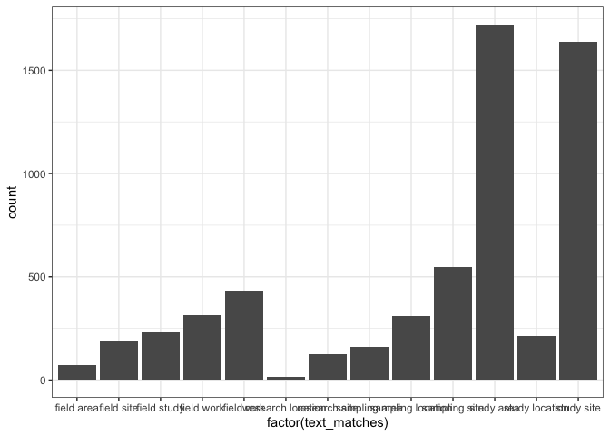
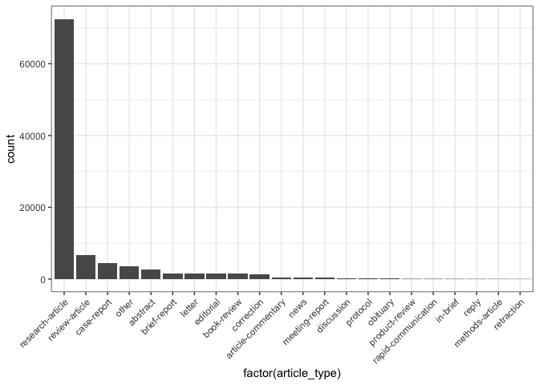
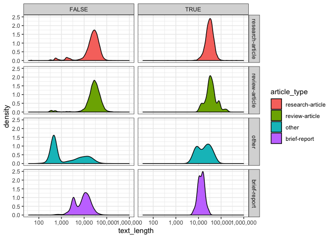
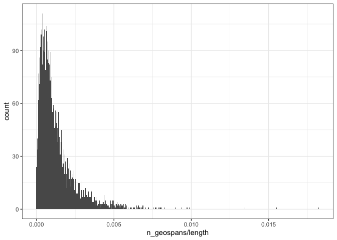
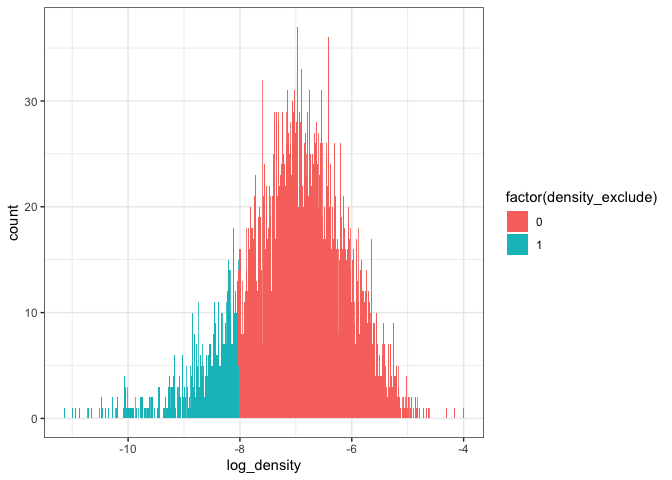

Article Metadata Summaries
================
Toph Allen
4/9/2019

``` r
terms <- read_lines("terms")

articles <- read_csv(here("data", "articles.csv")) %>%
  select(-X1, -id_types, -keywords)
id_types <- read_csv(here("data", "id_types.csv")) %>%
  select(-X1)
keywords <- read_csv(here("data", "keywords.csv")) %>%
  select(-X1)
text_matches <- read_csv(here("data", "text_matches.csv")) %>%
  select(-X1)
geonames <- read_csv(here("data", "geonames.csv")) %>%
  select(-X1)
subset <- read_csv(here("data", "subset.csv")) %>%
  select(-X1)
```

## Prevalence of Text Matches

We searched for four terms in the extracted text of articles, using
MongoDB’s text search capabilities. We think these terms will select
articles which have a fieldwork component over those that don’t. The
terms used are: field work, fieldwork, field study, field site, field
area, study site, study location, study area, research site, research
location, sampling site, sampling location, sampling area.

Matching articles are a smallish subset of the total, 4.442%.

``` r
ktable(articles$any_matches)
```

<table class="table table-hover table-condensed table-responsive" style="width: auto !important; ">

<thead>

<tr>

<th style="text-align:left;">

Var1

</th>

<th style="text-align:right;">

Freq

</th>

</tr>

</thead>

<tbody>

<tr>

<td style="text-align:left;">

FALSE

</td>

<td style="text-align:right;">

47779

</td>

</tr>

<tr>

<td style="text-align:left;">

TRUE

</td>

<td style="text-align:right;">

2221

</td>

</tr>

</tbody>

</table>

``` r
ktable(articles$text_matches) %>% scroll_box(height = "400px")
```

<div style="border: 1px solid #ddd; padding: 0px; overflow-y: scroll; height:400px; ">

<table class="table table-hover table-condensed table-responsive" style="width: auto !important; ">

<thead>

<tr>

<th style="text-align:left;position: sticky; top:0; background-color: #FFFFFF;">

Var1

</th>

<th style="text-align:right;position: sticky; top:0; background-color: #FFFFFF;">

Freq

</th>

</tr>

</thead>

<tbody>

<tr>

<td style="text-align:left;">

\[‘field area’, ‘study area’\]

</td>

<td style="text-align:right;">

4

</td>

</tr>

<tr>

<td style="text-align:left;">

\[‘field area’, ‘study site’\]

</td>

<td style="text-align:right;">

1

</td>

</tr>

<tr>

<td style="text-align:left;">

\[‘field area’\]

</td>

<td style="text-align:right;">

22

</td>

</tr>

<tr>

<td style="text-align:left;">

\[‘field site’, ‘sampling site’, ‘sampling location’\]

</td>

<td style="text-align:right;">

1

</td>

</tr>

<tr>

<td style="text-align:left;">

\[‘field site’, ‘sampling site’\]

</td>

<td style="text-align:right;">

2

</td>

</tr>

<tr>

<td style="text-align:left;">

\[‘field site’, ‘study area’, ‘sampling site’\]

</td>

<td style="text-align:right;">

1

</td>

</tr>

<tr>

<td style="text-align:left;">

\[‘field site’, ‘study area’\]

</td>

<td style="text-align:right;">

6

</td>

</tr>

<tr>

<td style="text-align:left;">

\[‘field site’, ‘study location’, ‘sampling location’\]

</td>

<td style="text-align:right;">

1

</td>

</tr>

<tr>

<td style="text-align:left;">

\[‘field site’, ‘study site’, ‘research site’\]

</td>

<td style="text-align:right;">

1

</td>

</tr>

<tr>

<td style="text-align:left;">

\[‘field site’, ‘study site’, ‘sampling location’\]

</td>

<td style="text-align:right;">

1

</td>

</tr>

<tr>

<td style="text-align:left;">

\[‘field site’, ‘study site’, ‘study area’, ‘sampling site’, ‘sampling
area’\]

</td>

<td style="text-align:right;">

1

</td>

</tr>

<tr>

<td style="text-align:left;">

\[‘field site’, ‘study site’, ‘study area’\]

</td>

<td style="text-align:right;">

7

</td>

</tr>

<tr>

<td style="text-align:left;">

\[‘field site’, ‘study site’, ‘study location’, ‘sampling site’\]

</td>

<td style="text-align:right;">

1

</td>

</tr>

<tr>

<td style="text-align:left;">

\[‘field site’, ‘study site’, ‘study location’\]

</td>

<td style="text-align:right;">

1

</td>

</tr>

<tr>

<td style="text-align:left;">

\[‘field site’, ‘study site’\]

</td>

<td style="text-align:right;">

8

</td>

</tr>

<tr>

<td style="text-align:left;">

\[‘field site’\]

</td>

<td style="text-align:right;">

32

</td>

</tr>

<tr>

<td style="text-align:left;">

\[‘field study’, ‘field site’, ‘study area’\]

</td>

<td style="text-align:right;">

1

</td>

</tr>

<tr>

<td style="text-align:left;">

\[‘field study’, ‘field site’, ‘study site’, ‘study area’\]

</td>

<td style="text-align:right;">

3

</td>

</tr>

<tr>

<td style="text-align:left;">

\[‘field study’, ‘field site’, ‘study site’\]

</td>

<td style="text-align:right;">

1

</td>

</tr>

<tr>

<td style="text-align:left;">

\[‘field study’, ‘field site’\]

</td>

<td style="text-align:right;">

5

</td>

</tr>

<tr>

<td style="text-align:left;">

\[‘field study’, ‘sampling area’\]

</td>

<td style="text-align:right;">

1

</td>

</tr>

<tr>

<td style="text-align:left;">

\[‘field study’, ‘sampling site’\]

</td>

<td style="text-align:right;">

2

</td>

</tr>

<tr>

<td style="text-align:left;">

\[‘field study’, ‘study area’, ‘sampling location’\]

</td>

<td style="text-align:right;">

1

</td>

</tr>

<tr>

<td style="text-align:left;">

\[‘field study’, ‘study area’, ‘sampling site’\]

</td>

<td style="text-align:right;">

1

</td>

</tr>

<tr>

<td style="text-align:left;">

\[‘field study’, ‘study area’\]

</td>

<td style="text-align:right;">

9

</td>

</tr>

<tr>

<td style="text-align:left;">

\[‘field study’, ‘study location’\]

</td>

<td style="text-align:right;">

1

</td>

</tr>

<tr>

<td style="text-align:left;">

\[‘field study’, ‘study site’, ‘sampling site’, ‘sampling location’\]

</td>

<td style="text-align:right;">

1

</td>

</tr>

<tr>

<td style="text-align:left;">

\[‘field study’, ‘study site’, ‘sampling site’\]

</td>

<td style="text-align:right;">

1

</td>

</tr>

<tr>

<td style="text-align:left;">

\[‘field study’, ‘study site’, ‘study area’, ‘sampling site’, ‘sampling
area’\]

</td>

<td style="text-align:right;">

1

</td>

</tr>

<tr>

<td style="text-align:left;">

\[‘field study’, ‘study site’, ‘study area’, ‘sampling site’\]

</td>

<td style="text-align:right;">

1

</td>

</tr>

<tr>

<td style="text-align:left;">

\[‘field study’, ‘study site’, ‘study area’\]

</td>

<td style="text-align:right;">

4

</td>

</tr>

<tr>

<td style="text-align:left;">

\[‘field study’, ‘study site’, ‘study location’\]

</td>

<td style="text-align:right;">

1

</td>

</tr>

<tr>

<td style="text-align:left;">

\[‘field study’, ‘study site’\]

</td>

<td style="text-align:right;">

7

</td>

</tr>

<tr>

<td style="text-align:left;">

\[‘field study’\]

</td>

<td style="text-align:right;">

64

</td>

</tr>

<tr>

<td style="text-align:left;">

\[‘field work’, ‘field site’, ‘study site’, ‘study area’\]

</td>

<td style="text-align:right;">

1

</td>

</tr>

<tr>

<td style="text-align:left;">

\[‘field work’, ‘field study’, ‘field site’, ‘study site’\]

</td>

<td style="text-align:right;">

1

</td>

</tr>

<tr>

<td style="text-align:left;">

\[‘field work’, ‘field study’, ‘study area’, ‘sampling site’\]

</td>

<td style="text-align:right;">

1

</td>

</tr>

<tr>

<td style="text-align:left;">

\[‘field work’, ‘field study’\]

</td>

<td style="text-align:right;">

2

</td>

</tr>

<tr>

<td style="text-align:left;">

\[‘field work’, ‘fieldwork’, ‘field site’, ‘study site’, ‘study area’\]

</td>

<td style="text-align:right;">

1

</td>

</tr>

<tr>

<td style="text-align:left;">

\[‘field work’, ‘fieldwork’, ‘field site’, ‘study site’\]

</td>

<td style="text-align:right;">

1

</td>

</tr>

<tr>

<td style="text-align:left;">

\[‘field work’, ‘fieldwork’, ‘field site’\]

</td>

<td style="text-align:right;">

2

</td>

</tr>

<tr>

<td style="text-align:left;">

\[‘field work’, ‘fieldwork’, ‘study area’\]

</td>

<td style="text-align:right;">

5

</td>

</tr>

<tr>

<td style="text-align:left;">

\[‘field work’, ‘fieldwork’, ‘study site’, ‘sampling site’, ‘sampling
location’\]

</td>

<td style="text-align:right;">

1

</td>

</tr>

<tr>

<td style="text-align:left;">

\[‘field work’, ‘fieldwork’, ‘study site’, ‘study area’\]

</td>

<td style="text-align:right;">

3

</td>

</tr>

<tr>

<td style="text-align:left;">

\[‘field work’, ‘fieldwork’, ‘study site’\]

</td>

<td style="text-align:right;">

2

</td>

</tr>

<tr>

<td style="text-align:left;">

\[‘field work’, ‘fieldwork’\]

</td>

<td style="text-align:right;">

9

</td>

</tr>

<tr>

<td style="text-align:left;">

\[‘field work’, ‘research site’\]

</td>

<td style="text-align:right;">

2

</td>

</tr>

<tr>

<td style="text-align:left;">

\[‘field work’, ‘sampling location’\]

</td>

<td style="text-align:right;">

1

</td>

</tr>

<tr>

<td style="text-align:left;">

\[‘field work’, ‘sampling site’\]

</td>

<td style="text-align:right;">

1

</td>

</tr>

<tr>

<td style="text-align:left;">

\[‘field work’, ‘study area’\]

</td>

<td style="text-align:right;">

20

</td>

</tr>

<tr>

<td style="text-align:left;">

\[‘field work’, ‘study location’, ‘study area’\]

</td>

<td style="text-align:right;">

3

</td>

</tr>

<tr>

<td style="text-align:left;">

\[‘field work’, ‘study site’, ‘sampling location’, ‘sampling area’\]

</td>

<td style="text-align:right;">

1

</td>

</tr>

<tr>

<td style="text-align:left;">

\[‘field work’, ‘study site’, ‘sampling location’\]

</td>

<td style="text-align:right;">

1

</td>

</tr>

<tr>

<td style="text-align:left;">

\[‘field work’, ‘study site’, ‘study area’, ‘sampling site’\]

</td>

<td style="text-align:right;">

1

</td>

</tr>

<tr>

<td style="text-align:left;">

\[‘field work’, ‘study site’, ‘study area’\]

</td>

<td style="text-align:right;">

11

</td>

</tr>

<tr>

<td style="text-align:left;">

\[‘field work’, ‘study site’, ‘study location’\]

</td>

<td style="text-align:right;">

1

</td>

</tr>

<tr>

<td style="text-align:left;">

\[‘field work’, ‘study site’\]

</td>

<td style="text-align:right;">

16

</td>

</tr>

<tr>

<td style="text-align:left;">

\[‘field work’\]

</td>

<td style="text-align:right;">

74

</td>

</tr>

<tr>

<td style="text-align:left;">

\[‘fieldwork’, ‘field site’, ‘research site’\]

</td>

<td style="text-align:right;">

1

</td>

</tr>

<tr>

<td style="text-align:left;">

\[‘fieldwork’, ‘field site’, ‘sampling area’\]

</td>

<td style="text-align:right;">

1

</td>

</tr>

<tr>

<td style="text-align:left;">

\[‘fieldwork’, ‘field site’, ‘study site’, ‘research location’\]

</td>

<td style="text-align:right;">

1

</td>

</tr>

<tr>

<td style="text-align:left;">

\[‘fieldwork’, ‘field site’\]

</td>

<td style="text-align:right;">

2

</td>

</tr>

<tr>

<td style="text-align:left;">

\[‘fieldwork’, ‘field study’, ‘study area’\]

</td>

<td style="text-align:right;">

1

</td>

</tr>

<tr>

<td style="text-align:left;">

\[‘fieldwork’, ‘field study’, ‘study site’, ‘study area’, ‘sampling
location’\]

</td>

<td style="text-align:right;">

1

</td>

</tr>

<tr>

<td style="text-align:left;">

\[‘fieldwork’, ‘field study’, ‘study site’, ‘study area’\]

</td>

<td style="text-align:right;">

1

</td>

</tr>

<tr>

<td style="text-align:left;">

\[‘fieldwork’, ‘field study’\]

</td>

<td style="text-align:right;">

1

</td>

</tr>

<tr>

<td style="text-align:left;">

\[‘fieldwork’, ‘research site’\]

</td>

<td style="text-align:right;">

3

</td>

</tr>

<tr>

<td style="text-align:left;">

\[‘fieldwork’, ‘sampling area’\]

</td>

<td style="text-align:right;">

1

</td>

</tr>

<tr>

<td style="text-align:left;">

\[‘fieldwork’, ‘sampling location’\]

</td>

<td style="text-align:right;">

3

</td>

</tr>

<tr>

<td style="text-align:left;">

\[‘fieldwork’, ‘sampling site’\]

</td>

<td style="text-align:right;">

1

</td>

</tr>

<tr>

<td style="text-align:left;">

\[‘fieldwork’, ‘study area’, ‘sampling area’\]

</td>

<td style="text-align:right;">

1

</td>

</tr>

<tr>

<td style="text-align:left;">

\[‘fieldwork’, ‘study area’, ‘sampling location’\]

</td>

<td style="text-align:right;">

1

</td>

</tr>

<tr>

<td style="text-align:left;">

\[‘fieldwork’, ‘study area’, ‘sampling site’, ‘sampling location’\]

</td>

<td style="text-align:right;">

1

</td>

</tr>

<tr>

<td style="text-align:left;">

\[‘fieldwork’, ‘study area’, ‘sampling site’\]

</td>

<td style="text-align:right;">

1

</td>

</tr>

<tr>

<td style="text-align:left;">

\[‘fieldwork’, ‘study area’\]

</td>

<td style="text-align:right;">

22

</td>

</tr>

<tr>

<td style="text-align:left;">

\[‘fieldwork’, ‘study location’, ‘research site’\]

</td>

<td style="text-align:right;">

1

</td>

</tr>

<tr>

<td style="text-align:left;">

\[‘fieldwork’, ‘study location’\]

</td>

<td style="text-align:right;">

1

</td>

</tr>

<tr>

<td style="text-align:left;">

\[‘fieldwork’, ‘study site’, ‘sampling site’\]

</td>

<td style="text-align:right;">

2

</td>

</tr>

<tr>

<td style="text-align:left;">

\[‘fieldwork’, ‘study site’, ‘study area’, ‘sampling location’\]

</td>

<td style="text-align:right;">

1

</td>

</tr>

<tr>

<td style="text-align:left;">

\[‘fieldwork’, ‘study site’, ‘study area’, ‘sampling site’, ‘sampling
area’\]

</td>

<td style="text-align:right;">

1

</td>

</tr>

<tr>

<td style="text-align:left;">

\[‘fieldwork’, ‘study site’, ‘study area’\]

</td>

<td style="text-align:right;">

17

</td>

</tr>

<tr>

<td style="text-align:left;">

\[‘fieldwork’, ‘study site’, ‘study location’, ‘study area’, ‘sampling
location’\]

</td>

<td style="text-align:right;">

1

</td>

</tr>

<tr>

<td style="text-align:left;">

\[‘fieldwork’, ‘study site’\]

</td>

<td style="text-align:right;">

14

</td>

</tr>

<tr>

<td style="text-align:left;">

\[‘fieldwork’\]

</td>

<td style="text-align:right;">

126

</td>

</tr>

<tr>

<td style="text-align:left;">

\[‘research location’\]

</td>

<td style="text-align:right;">

5

</td>

</tr>

<tr>

<td style="text-align:left;">

\[‘research site’, ‘research location’\]

</td>

<td style="text-align:right;">

1

</td>

</tr>

<tr>

<td style="text-align:left;">

\[‘research site’\]

</td>

<td style="text-align:right;">

36

</td>

</tr>

<tr>

<td style="text-align:left;">

\[‘sampling area’\]

</td>

<td style="text-align:right;">

39

</td>

</tr>

<tr>

<td style="text-align:left;">

\[‘sampling location’, ‘sampling area’\]

</td>

<td style="text-align:right;">

6

</td>

</tr>

<tr>

<td style="text-align:left;">

\[‘sampling location’\]

</td>

<td style="text-align:right;">

61

</td>

</tr>

<tr>

<td style="text-align:left;">

\[‘sampling site’, ‘sampling area’\]

</td>

<td style="text-align:right;">

11

</td>

</tr>

<tr>

<td style="text-align:left;">

\[‘sampling site’, ‘sampling location’, ‘sampling area’\]

</td>

<td style="text-align:right;">

1

</td>

</tr>

<tr>

<td style="text-align:left;">

\[‘sampling site’, ‘sampling location’\]

</td>

<td style="text-align:right;">

32

</td>

</tr>

<tr>

<td style="text-align:left;">

\[‘sampling site’\]

</td>

<td style="text-align:right;">

126

</td>

</tr>

<tr>

<td style="text-align:left;">

\[‘study area’, ‘research site’, ‘sampling area’\]

</td>

<td style="text-align:right;">

1

</td>

</tr>

<tr>

<td style="text-align:left;">

\[‘study area’, ‘research site’, ‘sampling site’\]

</td>

<td style="text-align:right;">

1

</td>

</tr>

<tr>

<td style="text-align:left;">

\[‘study area’, ‘research site’\]

</td>

<td style="text-align:right;">

4

</td>

</tr>

<tr>

<td style="text-align:left;">

\[‘study area’, ‘sampling area’\]

</td>

<td style="text-align:right;">

5

</td>

</tr>

<tr>

<td style="text-align:left;">

\[‘study area’, ‘sampling location’, ‘sampling area’\]

</td>

<td style="text-align:right;">

4

</td>

</tr>

<tr>

<td style="text-align:left;">

\[‘study area’, ‘sampling location’\]

</td>

<td style="text-align:right;">

13

</td>

</tr>

<tr>

<td style="text-align:left;">

\[‘study area’, ‘sampling site’, ‘sampling area’\]

</td>

<td style="text-align:right;">

4

</td>

</tr>

<tr>

<td style="text-align:left;">

\[‘study area’, ‘sampling site’, ‘sampling location’, ‘sampling area’\]

</td>

<td style="text-align:right;">

1

</td>

</tr>

<tr>

<td style="text-align:left;">

\[‘study area’, ‘sampling site’, ‘sampling location’\]

</td>

<td style="text-align:right;">

7

</td>

</tr>

<tr>

<td style="text-align:left;">

\[‘study area’, ‘sampling site’\]

</td>

<td style="text-align:right;">

28

</td>

</tr>

<tr>

<td style="text-align:left;">

\[‘study area’\]

</td>

<td style="text-align:right;">

513

</td>

</tr>

<tr>

<td style="text-align:left;">

\[‘study location’, ‘research site’\]

</td>

<td style="text-align:right;">

2

</td>

</tr>

<tr>

<td style="text-align:left;">

\[‘study location’, ‘sampling site’, ‘sampling location’\]

</td>

<td style="text-align:right;">

2

</td>

</tr>

<tr>

<td style="text-align:left;">

\[‘study location’, ‘sampling site’\]

</td>

<td style="text-align:right;">

1

</td>

</tr>

<tr>

<td style="text-align:left;">

\[‘study location’, ‘study area’, ‘sampling site’, ‘sampling location’\]

</td>

<td style="text-align:right;">

1

</td>

</tr>

<tr>

<td style="text-align:left;">

\[‘study location’, ‘study area’\]

</td>

<td style="text-align:right;">

12

</td>

</tr>

<tr>

<td style="text-align:left;">

\[‘study location’\]

</td>

<td style="text-align:right;">

62

</td>

</tr>

<tr>

<td style="text-align:left;">

\[‘study site’, ‘research location’, ‘sampling location’\]

</td>

<td style="text-align:right;">

1

</td>

</tr>

<tr>

<td style="text-align:left;">

\[‘study site’, ‘research location’\]

</td>

<td style="text-align:right;">

1

</td>

</tr>

<tr>

<td style="text-align:left;">

\[‘study site’, ‘research site’, ‘sampling location’\]

</td>

<td style="text-align:right;">

1

</td>

</tr>

<tr>

<td style="text-align:left;">

\[‘study site’, ‘research site’\]

</td>

<td style="text-align:right;">

6

</td>

</tr>

<tr>

<td style="text-align:left;">

\[‘study site’, ‘sampling area’\]

</td>

<td style="text-align:right;">

1

</td>

</tr>

<tr>

<td style="text-align:left;">

\[‘study site’, ‘sampling location’\]

</td>

<td style="text-align:right;">

6

</td>

</tr>

<tr>

<td style="text-align:left;">

\[‘study site’, ‘sampling site’, ‘sampling area’\]

</td>

<td style="text-align:right;">

1

</td>

</tr>

<tr>

<td style="text-align:left;">

\[‘study site’, ‘sampling site’, ‘sampling location’\]

</td>

<td style="text-align:right;">

5

</td>

</tr>

<tr>

<td style="text-align:left;">

\[‘study site’, ‘sampling site’\]

</td>

<td style="text-align:right;">

18

</td>

</tr>

<tr>

<td style="text-align:left;">

\[‘study site’, ‘study area’, ‘research site’\]

</td>

<td style="text-align:right;">

3

</td>

</tr>

<tr>

<td style="text-align:left;">

\[‘study site’, ‘study area’, ‘sampling area’\]

</td>

<td style="text-align:right;">

6

</td>

</tr>

<tr>

<td style="text-align:left;">

\[‘study site’, ‘study area’, ‘sampling location’, ‘sampling area’\]

</td>

<td style="text-align:right;">

1

</td>

</tr>

<tr>

<td style="text-align:left;">

\[‘study site’, ‘study area’, ‘sampling location’\]

</td>

<td style="text-align:right;">

3

</td>

</tr>

<tr>

<td style="text-align:left;">

\[‘study site’, ‘study area’, ‘sampling site’, ‘sampling area’\]

</td>

<td style="text-align:right;">

2

</td>

</tr>

<tr>

<td style="text-align:left;">

\[‘study site’, ‘study area’, ‘sampling site’, ‘sampling location’,
‘sampling area’\]

</td>

<td style="text-align:right;">

2

</td>

</tr>

<tr>

<td style="text-align:left;">

\[‘study site’, ‘study area’, ‘sampling site’\]

</td>

<td style="text-align:right;">

17

</td>

</tr>

<tr>

<td style="text-align:left;">

\[‘study site’, ‘study area’\]

</td>

<td style="text-align:right;">

120

</td>

</tr>

<tr>

<td style="text-align:left;">

\[‘study site’, ‘study location’, ‘sampling site’, ‘sampling area’\]

</td>

<td style="text-align:right;">

1

</td>

</tr>

<tr>

<td style="text-align:left;">

\[‘study site’, ‘study location’\]

</td>

<td style="text-align:right;">

8

</td>

</tr>

<tr>

<td style="text-align:left;">

\[‘study site’\]

</td>

<td style="text-align:right;">

476

</td>

</tr>

</tbody>

</table>

</div>

``` r
text_matches %>%
  filter(!is.na(text_matches)) %>%
  ggplot(aes(x = factor(text_matches))) +
  geom_bar(stat = "count") +
  theme_bw()
```

<!-- -->

## Examining characteristics of the subset

I pulled a few pieces of metadata for our subset of articles. These
include:

  - What type of article is it?
  - Does it have a `<body>` tag?
  - How long is it?
  - Associated keywords
  - What types of document identifiers does it have?

### Article types

There are many article types, but only a few which are widely used.

``` r
articles %<>%
  mutate(article_type = fct_infreq(article_type))
ktable(articles$article_type) %>% scroll_box(height = "400px")
```

<div style="border: 1px solid #ddd; padding: 0px; overflow-y: scroll; height:400px; ">

<table class="table table-hover table-condensed table-responsive" style="width: auto !important; ">

<thead>

<tr>

<th style="text-align:left;position: sticky; top:0; background-color: #FFFFFF;">

Var1

</th>

<th style="text-align:right;position: sticky; top:0; background-color: #FFFFFF;">

Freq

</th>

</tr>

</thead>

<tbody>

<tr>

<td style="text-align:left;">

research-article

</td>

<td style="text-align:right;">

36358

</td>

</tr>

<tr>

<td style="text-align:left;">

review-article

</td>

<td style="text-align:right;">

3313

</td>

</tr>

<tr>

<td style="text-align:left;">

case-report

</td>

<td style="text-align:right;">

2274

</td>

</tr>

<tr>

<td style="text-align:left;">

other

</td>

<td style="text-align:right;">

1800

</td>

</tr>

<tr>

<td style="text-align:left;">

abstract

</td>

<td style="text-align:right;">

1322

</td>

</tr>

<tr>

<td style="text-align:left;">

brief-report

</td>

<td style="text-align:right;">

801

</td>

</tr>

<tr>

<td style="text-align:left;">

editorial

</td>

<td style="text-align:right;">

785

</td>

</tr>

<tr>

<td style="text-align:left;">

book-review

</td>

<td style="text-align:right;">

772

</td>

</tr>

<tr>

<td style="text-align:left;">

letter

</td>

<td style="text-align:right;">

759

</td>

</tr>

<tr>

<td style="text-align:left;">

correction

</td>

<td style="text-align:right;">

626

</td>

</tr>

<tr>

<td style="text-align:left;">

news

</td>

<td style="text-align:right;">

224

</td>

</tr>

<tr>

<td style="text-align:left;">

article-commentary

</td>

<td style="text-align:right;">

201

</td>

</tr>

<tr>

<td style="text-align:left;">

meeting-report

</td>

<td style="text-align:right;">

163

</td>

</tr>

<tr>

<td style="text-align:left;">

discussion

</td>

<td style="text-align:right;">

95

</td>

</tr>

<tr>

<td style="text-align:left;">

protocol

</td>

<td style="text-align:right;">

85

</td>

</tr>

<tr>

<td style="text-align:left;">

obituary

</td>

<td style="text-align:right;">

83

</td>

</tr>

<tr>

<td style="text-align:left;">

product-review

</td>

<td style="text-align:right;">

56

</td>

</tr>

<tr>

<td style="text-align:left;">

rapid-communication

</td>

<td style="text-align:right;">

45

</td>

</tr>

<tr>

<td style="text-align:left;">

in-brief

</td>

<td style="text-align:right;">

39

</td>

</tr>

<tr>

<td style="text-align:left;">

methods-article

</td>

<td style="text-align:right;">

33

</td>

</tr>

<tr>

<td style="text-align:left;">

reply

</td>

<td style="text-align:right;">

33

</td>

</tr>

<tr>

<td style="text-align:left;">

retraction

</td>

<td style="text-align:right;">

28

</td>

</tr>

<tr>

<td style="text-align:left;">

systematic-review

</td>

<td style="text-align:right;">

25

</td>

</tr>

<tr>

<td style="text-align:left;">

data-paper

</td>

<td style="text-align:right;">

22

</td>

</tr>

<tr>

<td style="text-align:left;">

introduction

</td>

<td style="text-align:right;">

21

</td>

</tr>

<tr>

<td style="text-align:left;">

report

</td>

<td style="text-align:right;">

10

</td>

</tr>

<tr>

<td style="text-align:left;">

announcement

</td>

<td style="text-align:right;">

7

</td>

</tr>

<tr>

<td style="text-align:left;">

addendum

</td>

<td style="text-align:right;">

4

</td>

</tr>

<tr>

<td style="text-align:left;">

books-received

</td>

<td style="text-align:right;">

4

</td>

</tr>

<tr>

<td style="text-align:left;">

calendar

</td>

<td style="text-align:right;">

4

</td>

</tr>

<tr>

<td style="text-align:left;">

oration

</td>

<td style="text-align:right;">

4

</td>

</tr>

<tr>

<td style="text-align:left;">

expression-of-concern

</td>

<td style="text-align:right;">

2

</td>

</tr>

<tr>

<td style="text-align:left;">

index

</td>

<td style="text-align:right;">

2

</td>

</tr>

</tbody>

</table>

</div>

``` r
articles %>% 
  group_by(article_type) %>%
  mutate(n = n()) %>%
  filter(n > 50) %>%
  ungroup() %>%
  ggplot(aes(x = factor(article_type))) +
  geom_bar() +
  theme_bw() + theme(axis.text.x = element_text(angle = 45, hjust = 1))
```

<!-- -->

Does the usage of these differ between the fieldwork subset?

``` r
articles %>% 
  group_by(any_matches) %>%
  mutate(n_matches = n()) %>%
  group_by(any_matches, article_type) %>%
  summarize(type_freq = (n() / n_matches)[1]) %>%
  ungroup() %>%
  group_by(article_type) %>%
  filter(n() > 1) %>%
  ungroup() %>%
  ggplot(aes(x = factor(article_type), y = type_freq, fill = any_matches)) +
  geom_col(position = "dodge") +
  theme_bw() + theme(axis.text.x = element_text(angle = 45, hjust = 1))
```

<!-- -->

There are more research articles, and fewer of everything else.

### Presence of `<body>` tag

``` r
ktable(articles$has_body)
```

<table class="table table-hover table-condensed table-responsive" style="width: auto !important; ">

<thead>

<tr>

<th style="text-align:left;">

Var1

</th>

<th style="text-align:right;">

Freq

</th>

</tr>

</thead>

<tbody>

<tr>

<td style="text-align:left;">

FALSE

</td>

<td style="text-align:right;">

4519

</td>

</tr>

<tr>

<td style="text-align:left;">

TRUE

</td>

<td style="text-align:right;">

45481

</td>

</tr>

</tbody>

</table>

``` r
ktable(articles$article_type, articles$has_body) %>% scroll_box(height = "400px")
```

<div style="border: 1px solid #ddd; padding: 0px; overflow-y: scroll; height:400px; ">

<table class="table table-hover table-condensed table-responsive" style="width: auto !important; ">

<thead>

<tr>

<th style="text-align:left;position: sticky; top:0; background-color: #FFFFFF;">

</th>

<th style="text-align:right;position: sticky; top:0; background-color: #FFFFFF;">

FALSE

</th>

<th style="text-align:right;position: sticky; top:0; background-color: #FFFFFF;">

TRUE

</th>

</tr>

</thead>

<tbody>

<tr>

<td style="text-align:left;">

research-article

</td>

<td style="text-align:right;">

2056

</td>

<td style="text-align:right;">

34302

</td>

</tr>

<tr>

<td style="text-align:left;">

review-article

</td>

<td style="text-align:right;">

115

</td>

<td style="text-align:right;">

3198

</td>

</tr>

<tr>

<td style="text-align:left;">

case-report

</td>

<td style="text-align:right;">

13

</td>

<td style="text-align:right;">

2261

</td>

</tr>

<tr>

<td style="text-align:left;">

other

</td>

<td style="text-align:right;">

1021

</td>

<td style="text-align:right;">

779

</td>

</tr>

<tr>

<td style="text-align:left;">

abstract

</td>

<td style="text-align:right;">

270

</td>

<td style="text-align:right;">

1052

</td>

</tr>

<tr>

<td style="text-align:left;">

brief-report

</td>

<td style="text-align:right;">

17

</td>

<td style="text-align:right;">

784

</td>

</tr>

<tr>

<td style="text-align:left;">

editorial

</td>

<td style="text-align:right;">

79

</td>

<td style="text-align:right;">

706

</td>

</tr>

<tr>

<td style="text-align:left;">

book-review

</td>

<td style="text-align:right;">

500

</td>

<td style="text-align:right;">

272

</td>

</tr>

<tr>

<td style="text-align:left;">

letter

</td>

<td style="text-align:right;">

137

</td>

<td style="text-align:right;">

622

</td>

</tr>

<tr>

<td style="text-align:left;">

correction

</td>

<td style="text-align:right;">

25

</td>

<td style="text-align:right;">

601

</td>

</tr>

<tr>

<td style="text-align:left;">

news

</td>

<td style="text-align:right;">

93

</td>

<td style="text-align:right;">

131

</td>

</tr>

<tr>

<td style="text-align:left;">

article-commentary

</td>

<td style="text-align:right;">

3

</td>

<td style="text-align:right;">

198

</td>

</tr>

<tr>

<td style="text-align:left;">

meeting-report

</td>

<td style="text-align:right;">

98

</td>

<td style="text-align:right;">

65

</td>

</tr>

<tr>

<td style="text-align:left;">

discussion

</td>

<td style="text-align:right;">

2

</td>

<td style="text-align:right;">

93

</td>

</tr>

<tr>

<td style="text-align:left;">

protocol

</td>

<td style="text-align:right;">

0

</td>

<td style="text-align:right;">

85

</td>

</tr>

<tr>

<td style="text-align:left;">

obituary

</td>

<td style="text-align:right;">

72

</td>

<td style="text-align:right;">

11

</td>

</tr>

<tr>

<td style="text-align:left;">

product-review

</td>

<td style="text-align:right;">

0

</td>

<td style="text-align:right;">

56

</td>

</tr>

<tr>

<td style="text-align:left;">

rapid-communication

</td>

<td style="text-align:right;">

0

</td>

<td style="text-align:right;">

45

</td>

</tr>

<tr>

<td style="text-align:left;">

in-brief

</td>

<td style="text-align:right;">

1

</td>

<td style="text-align:right;">

38

</td>

</tr>

<tr>

<td style="text-align:left;">

methods-article

</td>

<td style="text-align:right;">

0

</td>

<td style="text-align:right;">

33

</td>

</tr>

<tr>

<td style="text-align:left;">

reply

</td>

<td style="text-align:right;">

7

</td>

<td style="text-align:right;">

26

</td>

</tr>

<tr>

<td style="text-align:left;">

retraction

</td>

<td style="text-align:right;">

0

</td>

<td style="text-align:right;">

28

</td>

</tr>

<tr>

<td style="text-align:left;">

systematic-review

</td>

<td style="text-align:right;">

0

</td>

<td style="text-align:right;">

25

</td>

</tr>

<tr>

<td style="text-align:left;">

data-paper

</td>

<td style="text-align:right;">

0

</td>

<td style="text-align:right;">

22

</td>

</tr>

<tr>

<td style="text-align:left;">

introduction

</td>

<td style="text-align:right;">

2

</td>

<td style="text-align:right;">

19

</td>

</tr>

<tr>

<td style="text-align:left;">

report

</td>

<td style="text-align:right;">

0

</td>

<td style="text-align:right;">

10

</td>

</tr>

<tr>

<td style="text-align:left;">

announcement

</td>

<td style="text-align:right;">

0

</td>

<td style="text-align:right;">

7

</td>

</tr>

<tr>

<td style="text-align:left;">

addendum

</td>

<td style="text-align:right;">

0

</td>

<td style="text-align:right;">

4

</td>

</tr>

<tr>

<td style="text-align:left;">

books-received

</td>

<td style="text-align:right;">

0

</td>

<td style="text-align:right;">

4

</td>

</tr>

<tr>

<td style="text-align:left;">

calendar

</td>

<td style="text-align:right;">

3

</td>

<td style="text-align:right;">

1

</td>

</tr>

<tr>

<td style="text-align:left;">

oration

</td>

<td style="text-align:right;">

3

</td>

<td style="text-align:right;">

1

</td>

</tr>

<tr>

<td style="text-align:left;">

expression-of-concern

</td>

<td style="text-align:right;">

0

</td>

<td style="text-align:right;">

2

</td>

</tr>

<tr>

<td style="text-align:left;">

index

</td>

<td style="text-align:right;">

2

</td>

<td style="text-align:right;">

0

</td>

</tr>

</tbody>

</table>

</div>

### Length

``` r
types <- articles %>%
  group_by(any_matches) %>%
  mutate(match_n = n()) %>%
  group_by(article_type) %>%
  mutate(type_n = n()) %>%
  group_by(any_matches, article_type) %>%
  summarize(match_x_type = n(),
            match_n = match_n[1],
            type_n = type_n[1]) %>%
  ungroup() %>%
  mutate(x_over_match = match_x_type / match_n,
         x_over_type = match_x_type / type_n)

type_filter <- types %>%
  filter(x_over_match > 0.005) %>%
  group_by(article_type) %>%
  filter(n() > 1) %>%
  pull(article_type) %>%
  unique()
```

``` r
ggplot(articles, aes(x = text_length)) +
  geom_density() +
  scale_x_log10(labels = comma) +
  theme_bw()
```

<!-- -->

``` r
ggplot(articles, aes(x = text_length, fill = any_matches)) +
  geom_density(alpha = 0.5) +
  scale_x_log10(labels = comma) +
  theme_bw()
```

<!-- -->

``` r
articles %>%
  group_by(article_type) %>%
  filter(n() > 100) %>%
  ggplot(aes(x = text_length, fill = article_type)) +
  geom_density(alpha = 0.25) +
  scale_x_log10(labels = comma) +
  theme_bw()
```

<!-- -->

``` r
articles %>%
  filter(article_type %in% type_filter) %>%
  ggplot(aes(x = text_length, fill = article_type)) +
  geom_density() +
  scale_x_log10(labels = comma) +
  facet_grid(article_type ~ any_matches) +
  theme_bw()
```

<!-- -->

### Usage of Keywords

``` r
keywords_per_paper <- keywords %>%
  group_by(id) %>%
  summarize(any_matches = unique(any_matches),
            n = n())
```

A total of 25549 papers out of 50000 (51.098%) had keywords.

For those matching fieldwork terms:

``` r
k <- keywords_per_paper %>%
  filter(any_matches == TRUE) %>%
  nrow()
nk <- articles %>%
  filter(any_matches == TRUE) %>%
  nrow()

k / nk * 100
```

    ## [1] 57.6317

For those not matching fieldwork terms:

``` r
k <- keywords_per_paper %>%
  filter(any_matches == FALSE) %>%
  nrow()
nk <- articles %>%
  filter(any_matches == FALSE) %>%
  nrow()

k / nk * 100
```

    ## [1] 50.79428

These are the top twenty-five keywords used in all documents:

``` r
keyword_summary <- keywords %>%
  group_by(keywords) %>%
  summarize(n = n()) %>%
  arrange(-n) %>%
  head(25)

knitr::kable(keyword_summary) %>%
  kable_styling(bootstrap_options = c("hover", "condensed", "responsive"),
                full_width = FALSE,
                position = "left") %>%
  scroll_box(height = "400px")
```

<div style="border: 1px solid #ddd; padding: 0px; overflow-y: scroll; height:400px; ">

<table class="table table-hover table-condensed table-responsive" style="width: auto !important; ">

<thead>

<tr>

<th style="text-align:left;position: sticky; top:0; background-color: #FFFFFF;">

keywords

</th>

<th style="text-align:right;position: sticky; top:0; background-color: #FFFFFF;">

n

</th>

</tr>

</thead>

<tbody>

<tr>

<td style="text-align:left;">

inflammation

</td>

<td style="text-align:right;">

174

</td>

</tr>

<tr>

<td style="text-align:left;">

breast cancer

</td>

<td style="text-align:right;">

173

</td>

</tr>

<tr>

<td style="text-align:left;">

apoptosis

</td>

<td style="text-align:right;">

171

</td>

</tr>

<tr>

<td style="text-align:left;">

cancer

</td>

<td style="text-align:right;">

163

</td>

</tr>

<tr>

<td style="text-align:left;">

HIV

</td>

<td style="text-align:right;">

163

</td>

</tr>

<tr>

<td style="text-align:left;">

prognosis

</td>

<td style="text-align:right;">

138

</td>

</tr>

<tr>

<td style="text-align:left;">

Breast cancer

</td>

<td style="text-align:right;">

121

</td>

</tr>

<tr>

<td style="text-align:left;">

Epidemiology

</td>

<td style="text-align:right;">

118

</td>

</tr>

<tr>

<td style="text-align:left;">

obesity

</td>

<td style="text-align:right;">

113

</td>

</tr>

<tr>

<td style="text-align:left;">

Obesity

</td>

<td style="text-align:right;">

111

</td>

</tr>

<tr>

<td style="text-align:left;">

meta-analysis

</td>

<td style="text-align:right;">

106

</td>

</tr>

<tr>

<td style="text-align:left;">

oxidative stress

</td>

<td style="text-align:right;">

106

</td>

</tr>

<tr>

<td style="text-align:left;">

children

</td>

<td style="text-align:right;">

105

</td>

</tr>

<tr>

<td style="text-align:left;">

Inflammation

</td>

<td style="text-align:right;">

104

</td>

</tr>

<tr>

<td style="text-align:left;">

epidemiology

</td>

<td style="text-align:right;">

102

</td>

</tr>

<tr>

<td style="text-align:left;">

colorectal cancer

</td>

<td style="text-align:right;">

93

</td>

</tr>

<tr>

<td style="text-align:left;">

depression

</td>

<td style="text-align:right;">

91

</td>

</tr>

<tr>

<td style="text-align:left;">

Children

</td>

<td style="text-align:right;">

88

</td>

</tr>

<tr>

<td style="text-align:left;">

aging

</td>

<td style="text-align:right;">

87

</td>

</tr>

<tr>

<td style="text-align:left;">

Apoptosis

</td>

<td style="text-align:right;">

87

</td>

</tr>

<tr>

<td style="text-align:left;">

microRNA

</td>

<td style="text-align:right;">

86

</td>

</tr>

<tr>

<td style="text-align:left;">

Iran

</td>

<td style="text-align:right;">

85

</td>

</tr>

<tr>

<td style="text-align:left;">

Alzheimer’s disease

</td>

<td style="text-align:right;">

84

</td>

</tr>

<tr>

<td style="text-align:left;">

Prognosis

</td>

<td style="text-align:right;">

83

</td>

</tr>

<tr>

<td style="text-align:left;">

metastasis

</td>

<td style="text-align:right;">

80

</td>

</tr>

</tbody>

</table>

</div>

For those matching fieldwork terms:

``` r
fw_keyword_summary <- keywords %>%
  filter(any_matches == TRUE) %>%
  group_by(keywords) %>%
  summarize(n = n()) %>%
  arrange(-n) %>%
  head(25)

knitr::kable(fw_keyword_summary) %>%
  kable_styling(bootstrap_options = c("hover", "condensed", "responsive"),
                full_width = FALSE,
                position = "left") %>%
  scroll_box(height = "400px")
```

<div style="border: 1px solid #ddd; padding: 0px; overflow-y: scroll; height:400px; ">

<table class="table table-hover table-condensed table-responsive" style="width: auto !important; ">

<thead>

<tr>

<th style="text-align:left;position: sticky; top:0; background-color: #FFFFFF;">

keywords

</th>

<th style="text-align:right;position: sticky; top:0; background-color: #FFFFFF;">

n

</th>

</tr>

</thead>

<tbody>

<tr>

<td style="text-align:left;">

Malaria

</td>

<td style="text-align:right;">

30

</td>

</tr>

<tr>

<td style="text-align:left;">

HIV

</td>

<td style="text-align:right;">

20

</td>

</tr>

<tr>

<td style="text-align:left;">

epidemiology

</td>

<td style="text-align:right;">

19

</td>

</tr>

<tr>

<td style="text-align:left;">

Ethiopia

</td>

<td style="text-align:right;">

18

</td>

</tr>

<tr>

<td style="text-align:left;">

Epidemiology

</td>

<td style="text-align:right;">

16

</td>

</tr>

<tr>

<td style="text-align:left;">

Plasmodium falciparum

</td>

<td style="text-align:right;">

15

</td>

</tr>

<tr>

<td style="text-align:left;">

India

</td>

<td style="text-align:right;">

13

</td>

</tr>

<tr>

<td style="text-align:left;">

Africa

</td>

<td style="text-align:right;">

12

</td>

</tr>

<tr>

<td style="text-align:left;">

malaria

</td>

<td style="text-align:right;">

12

</td>

</tr>

<tr>

<td style="text-align:left;">

Prevalence

</td>

<td style="text-align:right;">

12

</td>

</tr>

<tr>

<td style="text-align:left;">

South Africa

</td>

<td style="text-align:right;">

12

</td>

</tr>

<tr>

<td style="text-align:left;">

Tuberculosis

</td>

<td style="text-align:right;">

11

</td>

</tr>

<tr>

<td style="text-align:left;">

children

</td>

<td style="text-align:right;">

10

</td>

</tr>

<tr>

<td style="text-align:left;">

Tanzania

</td>

<td style="text-align:right;">

10

</td>

</tr>

<tr>

<td style="text-align:left;">

Brazil

</td>

<td style="text-align:right;">

9

</td>

</tr>

<tr>

<td style="text-align:left;">

Iran

</td>

<td style="text-align:right;">

9

</td>

</tr>

<tr>

<td style="text-align:left;">

Adolescents

</td>

<td style="text-align:right;">

8

</td>

</tr>

<tr>

<td style="text-align:left;">

GIS

</td>

<td style="text-align:right;">

8

</td>

</tr>

<tr>

<td style="text-align:left;">

influenza

</td>

<td style="text-align:right;">

8

</td>

</tr>

<tr>

<td style="text-align:left;">

Mental health

</td>

<td style="text-align:right;">

8

</td>

</tr>

<tr>

<td style="text-align:left;">

Physical activity

</td>

<td style="text-align:right;">

8

</td>

</tr>

<tr>

<td style="text-align:left;">

Plasmodium vivax

</td>

<td style="text-align:right;">

8

</td>

</tr>

<tr>

<td style="text-align:left;">

Risk factors

</td>

<td style="text-align:right;">

8

</td>

</tr>

<tr>

<td style="text-align:left;">

viruses

</td>

<td style="text-align:right;">

8

</td>

</tr>

<tr>

<td style="text-align:left;">

Children

</td>

<td style="text-align:right;">

7

</td>

</tr>

</tbody>

</table>

</div>

And those with no matches for fieldwork terms:

``` r
nofw_keyword_summary <- keywords %>%
  filter(any_matches == FALSE) %>%
  group_by(keywords) %>%
  summarize(n = n()) %>%
  arrange(-n) %>%
  head(25)

knitr::kable(nofw_keyword_summary) %>%
  kable_styling(bootstrap_options = c("hover", "condensed", "responsive"),
                full_width = FALSE,
                position = "left") %>%
  scroll_box(height = "400px")
```

<div style="border: 1px solid #ddd; padding: 0px; overflow-y: scroll; height:400px; ">

<table class="table table-hover table-condensed table-responsive" style="width: auto !important; ">

<thead>

<tr>

<th style="text-align:left;position: sticky; top:0; background-color: #FFFFFF;">

keywords

</th>

<th style="text-align:right;position: sticky; top:0; background-color: #FFFFFF;">

n

</th>

</tr>

</thead>

<tbody>

<tr>

<td style="text-align:left;">

inflammation

</td>

<td style="text-align:right;">

174

</td>

</tr>

<tr>

<td style="text-align:left;">

apoptosis

</td>

<td style="text-align:right;">

171

</td>

</tr>

<tr>

<td style="text-align:left;">

breast cancer

</td>

<td style="text-align:right;">

170

</td>

</tr>

<tr>

<td style="text-align:left;">

cancer

</td>

<td style="text-align:right;">

161

</td>

</tr>

<tr>

<td style="text-align:left;">

HIV

</td>

<td style="text-align:right;">

143

</td>

</tr>

<tr>

<td style="text-align:left;">

prognosis

</td>

<td style="text-align:right;">

137

</td>

</tr>

<tr>

<td style="text-align:left;">

Breast cancer

</td>

<td style="text-align:right;">

119

</td>

</tr>

<tr>

<td style="text-align:left;">

obesity

</td>

<td style="text-align:right;">

107

</td>

</tr>

<tr>

<td style="text-align:left;">

oxidative stress

</td>

<td style="text-align:right;">

105

</td>

</tr>

<tr>

<td style="text-align:left;">

Obesity

</td>

<td style="text-align:right;">

104

</td>

</tr>

<tr>

<td style="text-align:left;">

Inflammation

</td>

<td style="text-align:right;">

103

</td>

</tr>

<tr>

<td style="text-align:left;">

meta-analysis

</td>

<td style="text-align:right;">

103

</td>

</tr>

<tr>

<td style="text-align:left;">

Epidemiology

</td>

<td style="text-align:right;">

102

</td>

</tr>

<tr>

<td style="text-align:left;">

children

</td>

<td style="text-align:right;">

95

</td>

</tr>

<tr>

<td style="text-align:left;">

colorectal cancer

</td>

<td style="text-align:right;">

93

</td>

</tr>

<tr>

<td style="text-align:left;">

depression

</td>

<td style="text-align:right;">

88

</td>

</tr>

<tr>

<td style="text-align:left;">

Apoptosis

</td>

<td style="text-align:right;">

87

</td>

</tr>

<tr>

<td style="text-align:left;">

aging

</td>

<td style="text-align:right;">

86

</td>

</tr>

<tr>

<td style="text-align:left;">

microRNA

</td>

<td style="text-align:right;">

86

</td>

</tr>

<tr>

<td style="text-align:left;">

epidemiology

</td>

<td style="text-align:right;">

83

</td>

</tr>

<tr>

<td style="text-align:left;">

Alzheimer’s disease

</td>

<td style="text-align:right;">

81

</td>

</tr>

<tr>

<td style="text-align:left;">

Children

</td>

<td style="text-align:right;">

81

</td>

</tr>

<tr>

<td style="text-align:left;">

Prognosis

</td>

<td style="text-align:right;">

81

</td>

</tr>

<tr>

<td style="text-align:left;">

metastasis

</td>

<td style="text-align:right;">

80

</td>

</tr>

<tr>

<td style="text-align:left;">

Cancer

</td>

<td style="text-align:right;">

76

</td>

</tr>

</tbody>

</table>

</div>

And per fieldwork term:

``` r
kwd_x_match <- keywords %>%
  left_join(select(articles, id, text_matches), by = "id") %>%
  mutate(text_matches = replace_na(text_matches, ""))

for (term in terms) {
  print(paste("Term: ", term))
  kwd_x_match %>%
    filter(map_lgl(kwd_x_match$text_matches, ~str_detect(.x, fixed(term)))) %>%
    group_by(keywords) %>%
    summarize(n = n()) %>%
    arrange(desc(n)) %>%
    print()
}
```

    ## [1] "Term:  field work"
    ## # A tibble: 481 x 2
    ##    keywords            n
    ##    <chr>           <int>
    ##  1 India               4
    ##  2 Malaria             3
    ##  3 epidemiology        2
    ##  4 Ghana               2
    ##  5 HIV/AIDS            2
    ##  6 Kenya               2
    ##  7 Loop migration      2
    ##  8 malaria             2
    ##  9 Mayotte             2
    ## 10 microsatellites     2
    ## # … with 471 more rows
    ## [1] "Term:  fieldwork"
    ## # A tibble: 762 x 2
    ##    keywords           n
    ##    <chr>          <int>
    ##  1 South Africa       6
    ##  2 HIV                5
    ##  3 Africa             3
    ##  4 hypertension       3
    ##  5 Malawi             3
    ##  6 obesity            3
    ##  7 Brazil             2
    ##  8 children           2
    ##  9 climate change     2
    ## 10 dispersal          2
    ## # … with 752 more rows
    ## [1] "Term:  field study"
    ## # A tibble: 356 x 2
    ##    keywords              n
    ##    <chr>             <int>
    ##  1 Epidemiology          3
    ##  2 Malaria               3
    ##  3 Chiroptera            2
    ##  4 Drug resistance       2
    ##  5 Europe                2
    ##  6 health                2
    ##  7 Mosquito              2
    ##  8 seed treatment        2
    ##  9 West Nile virus       2
    ## 10 “quiet” courtyard     1
    ## # … with 346 more rows
    ## [1] "Term:  field site"
    ## # A tibble: 250 x 2
    ##    keywords                     n
    ##    <chr>                    <int>
    ##  1 Malaria                      3
    ##  2 Malawi                       2
    ##  3 "\nAnthophila\n"             1
    ##  4 "\nApoidea\n"                1
    ##  5 Acacia longifolia            1
    ##  6 Acoustic communication       1
    ##  7 Acoustic tracking            1
    ##  8 adaptive landscape           1
    ##  9 Aerial photography           1
    ## 10 agricultural abandonment     1
    ## # … with 240 more rows
    ## [1] "Term:  field area"
    ## # A tibble: 57 x 2
    ##    keywords           n
    ##    <chr>          <int>
    ##  1 Antioxidants       1
    ##  2 Archaea            1
    ##  3 asymmetry          1
    ##  4 Axis selective     1
    ##  5 axon               1
    ##  6 breast cancer      1
    ##  7 breast dose        1
    ##  8 C5aR1              1
    ##  9 Cancer             1
    ## 10 cancer therapy     1
    ## # … with 47 more rows
    ## [1] "Term:  study site"
    ## # A tibble: 2,244 x 2
    ##    keywords                   n
    ##    <chr>                  <int>
    ##  1 HIV                       16
    ##  2 Malaria                   14
    ##  3 Plasmodium falciparum      9
    ##  4 Tuberculosis               7
    ##  5 epidemiology               6
    ##  6 Ethiopia                   5
    ##  7 South Africa               5
    ##  8 Adolescents                4
    ##  9 antiretroviral therapy     4
    ## 10 Europe                     4
    ## # … with 2,234 more rows
    ## [1] "Term:  study location"
    ## # A tibble: 327 x 2
    ##    keywords                       n
    ##    <chr>                      <int>
    ##  1 Activities of daily living     2
    ##  2 Disability                     2
    ##  3 Epidemiology                   2
    ##  4 Malaria                        2
    ##  5 Malaysia                       2
    ##  6 meta-analysis                  2
    ##  7 Meta-analysis                  2
    ##  8 Obesity                        2
    ##  9 Physical activity              2
    ## 10 Prevalence                     2
    ## # … with 317 more rows
    ## [1] "Term:  study area"
    ## # A tibble: 2,364 x 2
    ##    keywords                  n
    ##    <chr>                 <int>
    ##  1 Ethiopia                 18
    ##  2 Malaria                  17
    ##  3 Epidemiology             10
    ##  4 epidemiology              9
    ##  5 malaria                   9
    ##  6 Iran                      7
    ##  7 Prevalence                7
    ##  8 GIS                       6
    ##  9 India                     6
    ## 10 Plasmodium falciparum     6
    ## # … with 2,354 more rows
    ## [1] "Term:  research site"
    ## # A tibble: 208 x 2
    ##    keywords                      n
    ##    <chr>                     <int>
    ##  1 expectations                  2
    ##  2 Mental health                 2
    ##  3 Pilot study                   2
    ##  4 qualitative research          2
    ##  5 accelerated EPI               1
    ##  6 Adolescent girls              1
    ##  7 Africa                        1
    ##  8 African American              1
    ##  9 agrobiodiversity              1
    ## 10 AHA Scientific Statements     1
    ## # … with 198 more rows
    ## [1] "Term:  research location"
    ## # A tibble: 38 x 2
    ##    keywords                 n
    ##    <chr>                <int>
    ##  1 indoor air pollution     2
    ##  2 particulate matter       2
    ##  3 PM2.5                    2
    ##  4 Aged                     1
    ##  5 Aged, 80 and Over        1
    ##  6 Androgenic alopecia      1
    ##  7 biomass fuels            1
    ##  8 Caregivers               1
    ##  9 Case study               1
    ## 10 casino                   1
    ## # … with 28 more rows
    ## [1] "Term:  sampling site"
    ## # A tibble: 843 x 2
    ##    keywords                             n
    ##    <chr>                            <int>
    ##  1 Genetic diversity                    4
    ##  2 16S rRNA gene                        3
    ##  3 bacteria                             3
    ##  4 Biodiversity                         3
    ##  5 Genetic structure                    3
    ##  6 16S rRNA                             2
    ##  7 Adaptive radiation                   2
    ##  8 Allergy                              2
    ##  9 Ammonia-oxidizing archaea (AOA)      2
    ## 10 Ammonia-oxidizing bacteria (AOB)     2
    ## # … with 833 more rows
    ## [1] "Term:  sampling location"
    ## # A tibble: 509 x 2
    ##    keywords                      n
    ##    <chr>                     <int>
    ##  1 16S rRNA gene                 3
    ##  2 adaptation                    2
    ##  3 Air                           2
    ##  4 Antarctica                    2
    ##  5 Brazil                        2
    ##  6 Crustacea                     2
    ##  7 Effective population size     2
    ##  8 environmental assessment      2
    ##  9 Genetic diversity             2
    ## 10 particulate matter            2
    ## # … with 499 more rows
    ## [1] "Term:  sampling area"
    ## # A tibble: 302 x 2
    ##    keywords                      n
    ##    <chr>                     <int>
    ##  1 bacteria                      2
    ##  2 16S rRNA metagenome           1
    ##  3 A. incertus                   1
    ##  4 abundance                     1
    ##  5 Acanthuridae                  1
    ##  6 Adolescent                    1
    ##  7 adult Anura                   1
    ##  8 African buffaloes             1
    ##  9 agricultural activity         1
    ## 10 Al2O3–ZrO2 nanocomposites     1
    ## # … with 292 more rows

## GeoNames

It looks like articles that match the fieldwork terms have many more
geonames in them than those that don’t.

``` r
summary(geonames)
```

    ##     n_spans        n_spans_over90  text_matches       any_matches    
    ##  Min.   :   0.00   Min.   :  0.0   Length:2000        Mode :logical  
    ##  1st Qu.:   4.00   1st Qu.:  1.0   Class :character   FALSE:1000     
    ##  Median :  14.00   Median :  4.0   Mode  :character   TRUE :1000     
    ##  Mean   :  29.55   Mean   : 11.6                                     
    ##  3rd Qu.:  33.00   3rd Qu.: 12.0                                     
    ##  Max.   :2448.00   Max.   :680.0

``` r
geonames %>% filter(any_matches == TRUE) %>% summary
```

    ##     n_spans        n_spans_over90   text_matches       any_matches   
    ##  Min.   :   0.00   Min.   :  0.00   Length:1000        Mode:logical  
    ##  1st Qu.:  13.00   1st Qu.:  3.00   Class :character   TRUE:1000     
    ##  Median :  27.00   Median :  9.00   Mode  :character                 
    ##  Mean   :  47.68   Mean   : 18.46                                    
    ##  3rd Qu.:  53.25   3rd Qu.: 20.00                                    
    ##  Max.   :2448.00   Max.   :680.00

``` r
geonames %>% filter(any_matches == FALSE) %>% summary
```

    ##     n_spans       n_spans_over90    text_matches       any_matches    
    ##  Min.   :  0.00   Min.   :  0.000   Length:1000        Mode :logical  
    ##  1st Qu.:  1.00   1st Qu.:  0.000   Class :character   FALSE:1000     
    ##  Median :  6.00   Median :  1.000   Mode  :character                  
    ##  Mean   : 11.43   Mean   :  4.743                                     
    ##  3rd Qu.: 14.00   3rd Qu.:  5.000                                     
    ##  Max.   :240.00   Max.   :211.000

## Subset

We’re going to take a brief look at the distribution of GeoNames and
text length in the subset.

``` r
summary(subset)
```

    ##       _id              length         n_geospans     
    ##  Min.   :  59655   Min.   :  3048   Min.   :   0.00  
    ##  1st Qu.:3776739   1st Qu.: 24279   1st Qu.:  14.00  
    ##  Median :4719217   Median : 31158   Median :  26.00  
    ##  Mean   :4652156   Mean   : 33492   Mean   :  43.32  
    ##  3rd Qu.:5625779   3rd Qu.: 39655   3rd Qu.:  50.00  
    ##  Max.   :6436149   Max.   :453774   Max.   :2448.00

``` r
ggplot(subset, aes(x = length)) +
  geom_histogram(binwidth = 1000) +
  theme_bw()
```

<!-- -->

``` r
ggplot(subset, aes(x = n_geospans)) +
  geom_histogram(binwidth = 10) +
  theme_bw()
```

<!-- -->

``` r
ggplot(subset, aes(x = n_geospans / length)) +
  geom_histogram(bins = 500) +
  theme_bw()
```

<!-- -->

``` r
ggplot(subset, aes(x = n_geospans / length)) +
  geom_histogram(bins = 500) +
  scale_x_log10() +
  theme_bw()
```

<!-- -->

``` r
deciles = seq(0, 1, 0.1)
quantile(subset$length, probs = deciles)
```

    ##     0%    10%    20%    30%    40%    50%    60%    70%    80%    90% 
    ##   3048  18614  22789  25835  28323  31158  34320  37611  42225  50307 
    ##   100% 
    ## 453774

``` r
quantile(subset$n_geospans, probs = deciles)
```

    ##   0%  10%  20%  30%  40%  50%  60%  70%  80%  90% 100% 
    ##    0    7   11   16   21   26   34   43   58   90 2448

``` r
quantiles = c(0.05, 0.25, 0.5, 0.75, 0.95)
quantile(subset$length, probs = quantiles)
```

    ##    5%   25%   50%   75%   95% 
    ## 15334 24279 31158 39655 56676

``` r
quantile(subset$n_geospans, probs = quantiles)
```

    ##  5% 25% 50% 75% 95% 
    ##   4  14  26  50 128

``` r
percentiles = seq(0, 1, 0.01)
quantile(subset$length, probs = percentiles)
```

    ##       0%       1%       2%       3%       4%       5%       6%       7% 
    ##   3048.0  10097.2  11867.0  13495.4  14598.2  15334.0  16246.0  17151.4 
    ##       8%       9%      10%      11%      12%      13%      14%      15% 
    ##  17570.6  18105.0  18614.0  19172.4  19603.2  20155.6  20623.0  20950.0 
    ##      16%      17%      18%      19%      20%      21%      22%      23% 
    ##  21407.4  21783.2  22126.8  22373.6  22789.0  23127.8  23359.2  23707.4 
    ##      24%      25%      26%      27%      28%      29%      30%      31% 
    ##  24051.2  24279.0  24621.6  24831.6  25133.2  25467.8  25835.0  26007.4 
    ##      32%      33%      34%      35%      36%      37%      38%      39% 
    ##  26309.2  26623.2  26848.8  27138.0  27351.4  27598.8  27845.4  28090.0 
    ##      40%      41%      42%      43%      44%      45%      46%      47% 
    ##  28323.0  28659.8  28912.0  29195.4  29395.6  29647.0  29959.0  30204.4 
    ##      48%      49%      50%      51%      52%      53%      54%      55% 
    ##  30656.8  30911.8  31158.0  31449.8  31779.6  32028.4  32360.0  32650.0 
    ##      56%      57%      58%      59%      60%      61%      62%      63% 
    ##  32893.8  33153.8  33507.8  33925.0  34320.0  34499.0  34928.2  35254.8 
    ##      64%      65%      66%      67%      68%      69%      70%      71% 
    ##  35594.4  35905.0  36268.0  36598.8  36887.4  37179.6  37611.0  37950.6 
    ##      72%      73%      74%      75%      76%      77%      78%      79% 
    ##  38260.0  38711.4  39043.4  39655.0  39931.2  40562.6  40989.2  41540.2 
    ##      80%      81%      82%      83%      84%      85%      86%      87% 
    ##  42225.0  42935.0  43630.4  44397.8  45034.8  45843.0  46560.0  47504.2 
    ##      88%      89%      90%      91%      92%      93%      94%      95% 
    ##  48158.2  49131.2  50307.0  51439.0  52317.0  53902.4  55178.2  56676.0 
    ##      96%      97%      98%      99%     100% 
    ##  59660.6  64040.8  67078.2  77687.0 453774.0

``` r
quantile(subset$n_geospans, probs = percentiles)
```

    ##     0%     1%     2%     3%     4%     5%     6%     7%     8%     9% 
    ##    0.0    1.0    2.0    3.0    4.0    4.0    5.0    6.0    6.0    7.0 
    ##    10%    11%    12%    13%    14%    15%    16%    17%    18%    19% 
    ##    7.0    7.6    8.0    8.0    9.0    9.0   10.0   10.0   11.0   11.0 
    ##    20%    21%    22%    23%    24%    25%    26%    27%    28%    29% 
    ##   11.0   12.0   12.0   13.0   13.0   14.0   14.0   15.0   15.0   15.0 
    ##    30%    31%    32%    33%    34%    35%    36%    37%    38%    39% 
    ##   16.0   17.0   17.0   18.0   18.0   19.0   19.0   19.2   20.0   21.0 
    ##    40%    41%    42%    43%    44%    45%    46%    47%    48%    49% 
    ##   21.0   22.0   22.0   23.0   23.0   24.0   24.0   25.0   25.0   26.0 
    ##    50%    51%    52%    53%    54%    55%    56%    57%    58%    59% 
    ##   26.0   27.0   28.0   29.0   29.0   30.0   31.0   32.0   32.0   33.0 
    ##    60%    61%    62%    63%    64%    65%    66%    67%    68%    69% 
    ##   34.0   35.0   35.0   37.0   37.0   38.0   39.0   40.0   40.0   42.0 
    ##    70%    71%    72%    73%    74%    75%    76%    77%    78%    79% 
    ##   43.0   45.0   47.0   48.0   49.0   50.0   52.0   53.0   55.0   56.0 
    ##    80%    81%    82%    83%    84%    85%    86%    87%    88%    89% 
    ##   58.0   60.0   62.0   65.0   67.0   71.0   74.0   77.0   81.0   85.0 
    ##    90%    91%    92%    93%    94%    95%    96%    97%    98%    99% 
    ##   90.0   96.2  105.2  110.0  115.4  128.0  141.0  158.0  186.6  234.2 
    ##   100% 
    ## 2448.0

``` r
qplot(seq(0, 1, 0.01), quantile(subset$length, probs = percentiles)) + theme_bw()
```

<!-- -->

``` r
qplot(seq(0, 1, 0.01), quantile(subset$n_geospans, probs = percentiles)) + theme_bw()
```

<!-- -->

We will only include documents which are:

  - longer than 1% and shorter than 5% of documents or 60,000
    characters;
  - include more GeoNames than 25% of documents, and fewer than 99%.

### Density

I will also consider subsetting on `n_geospans / length`.

``` r
subset <- subset %>%
  filter(n_geospans > 0) %>%
  mutate(density = n_geospans / length,
         log_density = log(density))

mean(subset$log_density)
```

    ## [1] -7.078539

``` r
sd(subset$log_density)
```

    ## [1] 0.9651259

``` r
subset <- subset %>%
  mutate(density_exclude = ifelse(log_density < mean(log_density) - sd(log_density), 1, 0))

ggplot(subset, aes(x = density)) +
  geom_histogram(bins = 500, aes(fill = factor(density_exclude))) +
  theme_bw()
```

<!-- -->

``` r
ggplot(subset, aes(x = density)) +
  geom_histogram(bins = 500, aes(fill = factor(ifelse(log_density < median(log_density), 1, 0)))) +
  theme_bw()
```

<!-- -->

``` r
ggplot(subset, aes(x = length, y = n_geospans, color = factor(density_exclude))) +
  geom_point() +
  theme_bw()
```

<!-- -->

``` r
ggplot(subset, aes(x = length, y = n_geospans, color = factor(ifelse(log_density < median(log_density), 1, 0)))) +
  geom_point() +
  theme_bw()
```

<!-- -->

## Summary

We should use documents which

  - match this set of search terms;
  - have a `<body>` tag;
  - are a `"research-article"`.

We could also consider including `"review-article"` and `"brief-report"`
types, but those seem fairly uncommon.
